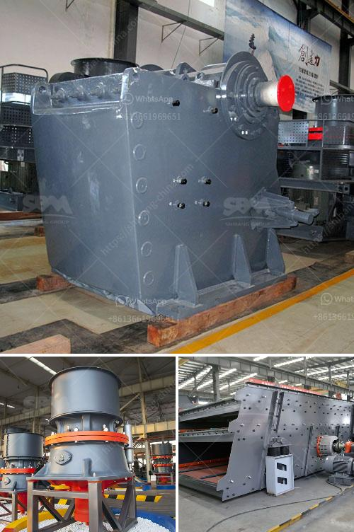

<h3>iron ore washing plant</h3>
Iron ore is one of the most important ores in the world. It is primarily used to produce steel, an essential raw material for various industries. However, the extraction and processing of iron ore require the use of advanced machinery to ensure optimal productivity and minimize environmental impact. Therefore, the iron ore washing plant plays an essential role in maximizing the purity of the iron ore, minimizing pollutants, and increasing the efficiency of production.

The iron ore washing plant consists of five main components, namely scrubbing, classification, fines recovery, magnetic separation, and water recovery. Scrubbing removes the harmful pollutants and excess materials, while classification allows the particles to be separated according to size and density. Fines recovery allows for the recovery of valuable iron ore fines while reducing waste materials. Magnetic separation is used to separate magnetic minerals from the non-magnetic ones, and water recovery removes the remaining water from the washed ore.

One of the main benefits of the iron ore washing plant is the potential to significantly reduce waste materials. Without the washing plant, mining companies would have to dispose of millions of tons of low-grade ore waste. With the effective use of the washing plant, waste material can be processed into re-usable products, thereby reducing waste and increasing operational efficiency.

In addition to reducing waste, the iron ore washing plant can produce higher-quality iron ore concentrate. The washing plant consists of several components, including the scrubber, vibrating screens, hydrocyclones, and magnetic separators. Low-grade iron ore is first ground into finer particles, which allows for better extraction of the metal. Once the low-grade ore is ground, it is then passed through a series of hydrocyclones, which separates the fine particles from the coarser ones. The fine particles go through a magnetic separator, which removes any remaining impurities. The resulting concentrate is a higher-grade ore that can be used for steel production.

Another advantage of the iron ore washing plant is its ability to handle different types of ores. This flexibility allows mining companies to optimize their processing plants for various ore characteristics. Whether the ore is high in iron content or contains a high level of impurities, the washing plant can adjust its parameters to ensure optimal processing.

However, operating an iron ore washing plant can be challenging due to the nature of the feed material and the limitations of process equipment. Optimal process design relies on a thorough understanding of the ore characteristics, including particle size distribution, mineralogy, and liberation. Additionally, efficient water management and effective tailings disposal are crucial to ensure environmental compliance.

In conclusion, the iron ore washing plant is an essential part of the steelmaking process and can significantly contribute to the successful and sustainable operation of a mine. While the challenges in iron ore processing are immense, the benefits of the washing plant are equally impressive. By optimizing the performance of the washing plant, mining companies can maximize productivity, reduce waste, and enhance the quality of their iron ore products, ultimately improving their bottom line while minimizing their environmental footprint.
<h3>Contact us</h3><ul><li><strong>Whatsapp:&nbsp;<a href="https://wa.me/8613661969651">+8613661969651</a></strong></li><li><a href="https://swt.shibang-china.com/?git&amp;zhl&amp;iron ore washing plant"><strong>Online Service(chat now)</strong></a></li></ul><h3>Related</h3><ul><li><a href='sample business plan for gold mine.md'>sample business plan for gold mine</a></li><li><a href='coal crusher machine manufacturers.md'>coal crusher machine manufacturers</a></li><li><a href='stone crusher mills in mercadolibre.md'>stone crusher mills in mercadolibre</a></li><li><a href='full quarry machines for sale in china.md'>full quarry machines for sale in china</a></li><li><a href='19mm crusher stone philippines quarry.md'>19mm crusher stone philippines quarry</a></li></ul>