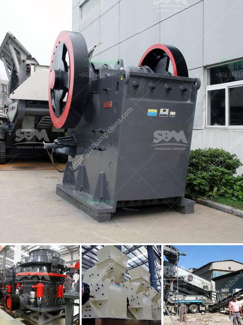

<h3>jaw crusher 24x12 price</h3>
The jaw crusher 24x12 price is not fixed. It depends on several factors such as the machine's brand, manufacturer, capacity, type, and technological advancements. The crusher machinery's overall cost is influenced by its various components including power supply, machine parts, maintenance costs, and even the cost of transportation.

One of the most appealing factors in choosing a jaw crusher machine is its ease-of-use. A quality machine that is easy to use can increase the productivity of the workforce by minimizing downtime. A user-friendly machine does not require skilled labor force, therefore reducing the overall labor cost.

Due to the vast range of crushers available in the market, finding the right machine for the job is important. Ensuring that the equipment selected is the right fit for the project is crucial, as the productivity and efficiency of the crushing process are influenced by the characteristics of the material and the crusher itself.

The cost-effective operation is crucial when considering crushing machinery. A well-designed jaw crusher machine should have an efficient and operational electrical system. This allows operators to easily monitor and regulate the machine's settings in order to achieve optimal performance. Operators should also regularly inspect and maintain the machine to ensure it remains in good working condition and maximizes its lifespan.

The size and capacity of a crusher machine are designed to be proportional to the investment required, therefore the price of the machine will typically increase as the size and capacity increase. However, the overall cost per ton of crushed material is slightly lower in larger capacity machines. This means that a larger machine is more cost-effective over the long term, despite the initial higher investment.

The 24x12 size jaw crusher is designed for crushing hard and abrasive materials, such as granite, limestone, aggregate, basalt, river gravel, etc. It is capable of processing 320 to 450 tons per hour and is widely used in sand and gravel, construction waste crushing, coal mines, concrete recycling, etc.

The jaw crusher has a big crushing ratio, uniform product size, simple structure, reliable operation, easy maintenance, low operation cost, and so on. Widely used in mining, smelting, building material, highway, railway, water conservancy and chemical industries and many sectors, not more than 320 MPa breaking strength of various materials.

In conclusion, the jaw crusher 24x12 price and operating cost must be taken into consideration by the businesses when purchasing the machinery. Understanding the factors that affect the price of the equipment will help businesses make the right decision and improve their overall productivity. Additionally, investing in a reliable and efficient jaw crusher machine will ensure that the material is processed efficiently, reducing downtime and maximizing profits.
<h3>Contact us</h3><ul><li><strong>Whatsapp:&nbsp;<a href="https://wa.me/8613661969651">+8613661969651</a></strong></li><li><a href="https://swt.shibang-china.com/?git&amp;zhl&amp;jaw crusher 24x12 price"><strong>Online Service(chat now)</strong></a></li></ul><h3>Related</h3><ul><li><a href='business plan of silica sand crusher factory.md'>business plan of silica sand crusher factory</a></li><li><a href='machinery for magnesium extracted from dolomite.md'>machinery for magnesium extracted from dolomite</a></li><li><a href='hammer mill dealer in cebu.md'>hammer mill dealer in cebu</a></li><li><a href='enquiry about stone crusher.md'>enquiry about stone crusher</a></li><li><a href='ball mills in solidwork.md'>ball mills in solidwork</a></li></ul>