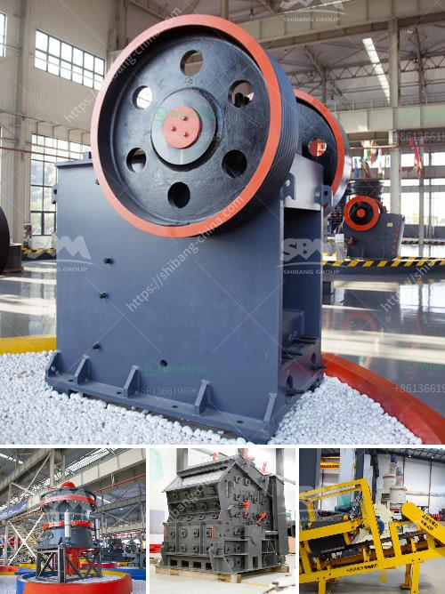

<h3>jaw crusher and cone crusher manufacturers in dubai</h3>
In recent years, the UAE government has taken various measures to promote the sustainable development of infrastructure and urbanization projects across the region. The use of jaw crushers and cone crushers in the UAE is rapidly increasing, with various construction projects being contracted across the country. The demand for these machines is increasing as both local and international manufacturers establish their presence in Dubai.

Jaw crushers are primarily used in mining, quarrying, and material processing operations. They are designed to crush hard and abrasive materials, including granite, basalt, and ores. These machines have a high crushing ratio, making them suitable for primary crushing stages. Cone crushers, on the other hand, are more often used for secondary and tertiary crushing purposes. They are renowned for their ability to produce high-quality and cubical-shaped aggregates.

Several notable manufacturers of jaw crushers and cone crushers have established their presence in Dubai. Some of these manufacturers include:

1. Terex: Terex is a leading manufacturer of jaw and cone crushers globally. Their products are renowned for their reliability, durability, and high performance. Terex jaw crushers are widely used in various industries, including quarrying, mining, and recycling. Their cone crushers are known for their versatility and ability to produce finely crushed materials.

2. Sandvik: Sandvik is another well-known manufacturer of jaw and cone crushers. Their machines are widely used in the mining and quarrying industries worldwide. Sandvik crushers are highly efficient and offer high capacity for large-scale operations. Their cone crushers are particularly popular due to their innovative features, such as automatic setting adjustment and hydraulic cleaning.

3. Metso: Metso is a Finnish manufacturer of crushers and other mining equipment. They offer a wide range of jaw and cone crushers suitable for various applications. Metso crushers are known for their advanced technology, durability, and high performance. Their cone crushers are particularly renowned for their excellent particle shape and precise control of the crushing process.

4. McCloskey International: McCloskey International is a Canadian manufacturer of crushers and screeners. Their jaw and cone crushers are designed for high productivity and ease of maintenance. McCloskey crushers are known for their fuel efficiency and low operating costs. Their cone crushers feature a unique combination of high crushing force and high eccentricity, resulting in high-performance crushing.

5. Propel Industries: Propel Industries is an Indian manufacturer of jaw and cone crushers. Their products are designed to provide efficient and reliable performance in various applications. Propel jaw crushers are known for their rugged construction and exceptional reliability. Their cone crushers feature a unique combination of chamber design, eccentricity, and stroke, resulting in high productivity and excellent product shape.

These are just a few of the many reputable jaw crusher and cone crusher manufacturers operating in Dubai. The market for these machines is expected to grow exponentially as more infrastructure projects are implemented in the UAE. With the government's focus on sustainable development, the demand for high-quality and efficient crushers will continue to rise. Whether it's for large-scale mining operations or small-scale construction projects, these manufacturers offer a wide range of crushers to meet the diverse needs of customers in Dubai and beyond.
<h3>Contact us</h3><ul><li><strong>Whatsapp:&nbsp;<a href="https://wa.me/8613661969651">+8613661969651</a></strong></li><li><a href="https://swt.shibang-china.com/?git&amp;zhl&amp;jaw crusher and cone crusher manufacturers in dubai"><strong>Online Service(chat now)</strong></a></li></ul><h3>Related</h3><ul><li><a href='ball milling machines suppliers in egypt.md'>ball milling machines suppliers in egypt</a></li><li><a href='beneficiation plant process line diagram.md'>beneficiation plant process line diagram</a></li><li><a href='ballast crusher machine.md'>ballast crusher machine</a></li><li><a href='second hand hp cone crusher au.md'>second hand hp cone crusher au</a></li><li><a href='ball mills in autocad.md'>ball mills in autocad</a></li></ul>