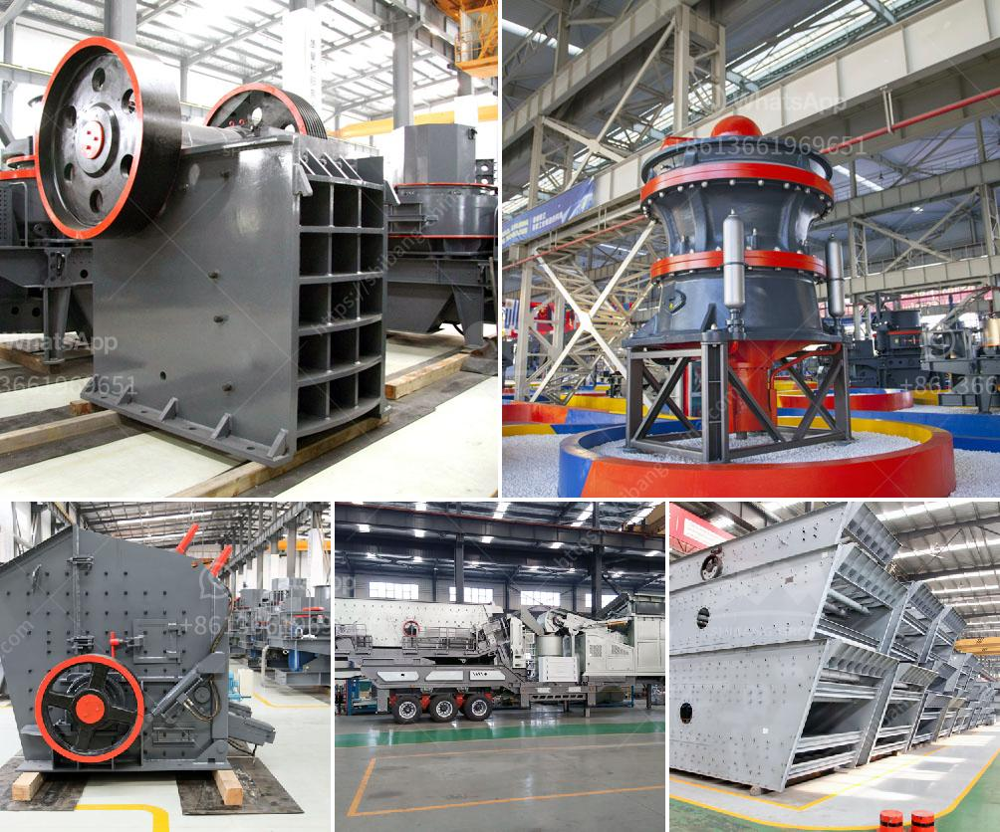

<h3>jaw crusher discount</h3>
A jaw crusher is an essential piece of equipment in the mining industry. It is used to break down large rocks into smaller pieces, which are then used for various applications like construction materials, road building, and more. However, purchasing a jaw crusher can be a significant investment. That's why taking advantage of jaw crusher discounts can help you save a substantial amount of money.

Jaw crusher manufacturers frequently offer discounts to promote their products and attract new customers. These discounts can range from a certain percentage off the original price to exclusive package deals that include additional items or services. By taking advantage of these discounts, you can acquire a high-quality jaw crusher at a much more affordable price.

The money you save on purchasing a discounted jaw crusher can be utilized in other areas of your mining operation. Whether you need to invest in additional machinery, upgrade your facilities, or hire more staff, the savings from a discounted jaw crusher can contribute to these essential factors. This, in turn, can improve the overall efficiency and productivity of your mining operation.

Another advantage of obtaining a jaw crusher at a discounted price is that it allows you to stay within your budget while still acquiring top-tier equipment. Jaw crushers are available in various sizes and specifications, with different features and capabilities. Generally, higher-quality models with more advanced features tend to come with a higher price tag. However, with the discounts offered, you can access these high-performing crushers without exceeding your budget.

It is crucial to keep an eye out for jaw crusher discounts from reputable manufacturers or authorized dealers. Researching and comparing different suppliers can help you find the best deals available. Additionally, consider the after-sales services and warranties provided by the manufacturer to ensure that you are making a reliable investment.

In conclusion, taking advantage of jaw crusher discounts can help you save a significant amount of money while acquiring a crucial piece of mining equipment. The savings can be utilized in other areas of your operation, driving growth and efficiency. Always research reputable manufacturers and compare deals to ensure you are making a reliable investment that meets your needs.
<h3>Contact us</h3><ul><li><strong>Whatsapp:&nbsp;<a href="https://wa.me/8613661969651">+8613661969651</a></strong></li><li><a href="https://swt.shibang-china.com/?git&amp;zhl&amp;jaw crusher discount"><strong>Online Service(chat now)</strong></a></li></ul><h3>Related</h3><ul><li><a href='gold mining equipment manufacturers.md'>gold mining equipment manufacturers</a></li><li><a href='basalt processing plant.md'>basalt processing plant</a></li><li><a href='used quarry equipment from usa.md'>used quarry equipment from usa</a></li><li><a href='coal milling machine.md'>coal milling machine</a></li><li><a href='crush stone machinery.md'>crush stone machinery</a></li></ul>