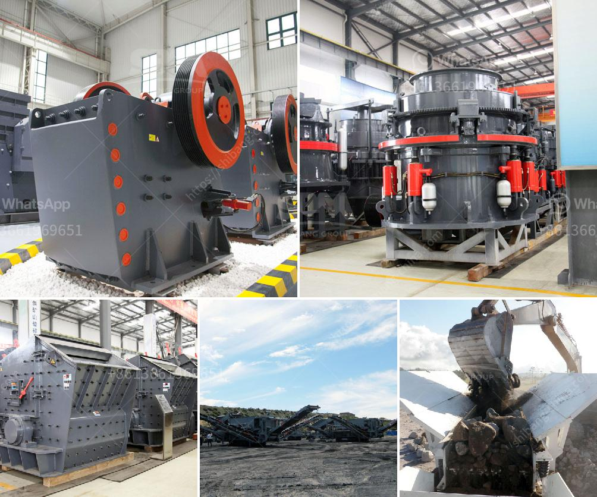

<h3>jaw crusher for sale in spain</h3>
The jaw crusher is an important machine in the quarrying industry. It enables the crushing of large rocks into smaller stones or gravel in order to fulfill different requirements for construction materials. Jaw crushers are highly popular in Spain due to their high efficiency and excellent performance. Many Spanish constructors and building companies rely on jaw crushers to process large rocks and minerals with minimal effort.

The jaw crusher is widely used in stone mining, metallurgy industry, building material, highway, railway, and chemical industry. It has a feature of large crushing ratio, high capacity, uniform end product size, simple structure, reliable operation, easy maintenance, low operating cost, and so on. Jaw crushers are ideal for primary crushing and secondary crushing.

The jaw crusher for sale in Spain is the most commonly used type of crushing equipment in quarry applications, comprising several different models depending on the application. The crushing process can be divided into two phases: coarse crushing and fine crushing.

Jaw crushers crush large stones or rocks into smaller ones, reducing them to gravel or rock dust. The mechanical pressure used in jaw crushers creates sufficient force to break the particles into smaller pieces. As a result, the material is crushed to the desired size and discharged through the output opening.

Jaw crushers offer numerous benefits to quarry operators and construction companies in Spain. These include:

1. Versatility: Jaw crushers can crush a variety of materials, whether brittle or hard, making them highly versatile. They can handle rocks of various sizes and hardness, making it easy to adjust the machine to suit specific needs.

2. Efficiency: Jaw crushers are efficient machines designed to reduce large rocks into smaller stones or gravel. They offer a high crushing ratio, which means that the desired size of the material can be achieved with minimal effort.

3. Reliability: Jaw crushers are robust machines that are built to last. They are designed to withstand the harshest conditions and are known for their reliability and durability.

4. Easy maintenance: Jaw crushers are easy to maintain and require minimal maintenance. They have few moving parts, reducing the risk of breakdowns and making it easy to replace worn-out parts.

For quarry operators and building companies seeking jaw crushers for sale in Spain, companies such as Sandvik and Metso offer models that are heavy-duty, durable, and highly efficient. These crushers can handle a wide range of materials and meet the required specifications for various construction projects.

Jaw crushers are an essential piece of equipment in the quarrying industry, enabling the crushing of large rocks into smaller stones or gravel. Their efficiency and reliability make them highly popular machines among construction companies and quarry operators in Spain. With a wide range of benefits, including versatility, high efficiency, and easy maintenance, jaw crushers are a valuable addition to any quarry operation.
<h3>Contact us</h3><ul><li><strong>Whatsapp:&nbsp;<a href="https://wa.me/8613661969651">+8613661969651</a></strong></li><li><a href="https://swt.shibang-china.com/?git&amp;zhl&amp;jaw crusher for sale in spain"><strong>Online Service(chat now)</strong></a></li></ul><h3>Related</h3><ul><li><a href='supplier of granite crusher.md'>supplier of granite crusher</a></li><li><a href='high grinding mill quicklime.md'>high grinding mill quicklime</a></li><li><a href='rock crusher screen.md'>rock crusher screen</a></li><li><a href='sell stone crusher in philippines.md'>sell stone crusher in philippines</a></li><li><a href='marble grinding machine bosch make.md'>marble grinding machine bosch make</a></li></ul>