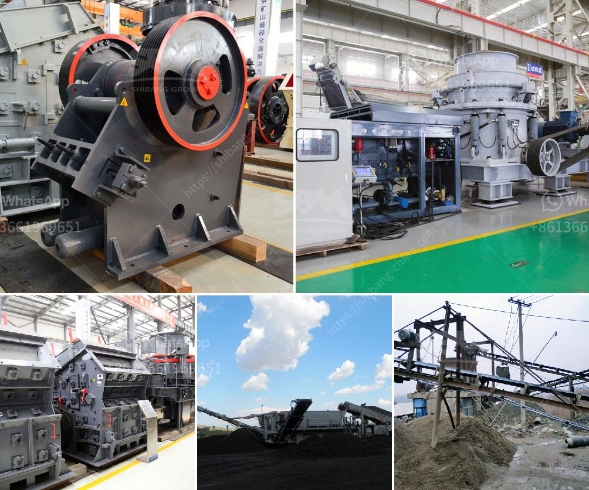

<h3>jaw crusher for sale ton per hour</h3>
The jaw crusher is a versatile and powerful crushing device that crushes large-sized rocks to a granularity suitable for secondary and tertiary crushing applications. The mechanism behind these jaw crushers is simple; the movable jaw exerts force on the rock by pressing it against the stationary plate, thereby crushing it into smaller pieces that can be further processed.

One of the advantages of using a jaw crusher is its ability to produce a consistent and uniform product size. This is achieved through the adjustable opening at the bottom of the crusher, which determines the final product size. Additionally, the wide feed opening allows for the processing of large-sized rocks, reducing the need for pre-screening.

When looking for a jaw crusher for sale, ton per hour capacity is an important factor to consider. This capacity represents the maximum capacity of the crusher and should be chosen based on the expected capacity needed for your operation. Typically, a jaw crusher should be capable of crushing 2-3 tons per hour, which equates to a capacity of 200-300 tons per hour.

Conversely, a smaller model capacity-wise, such as the Keestrack B5, has a maximum capacity of 230 tonnes per hour. This jaw crusher can handle rocks up to 700mm in size and reduce them to a final product size of 0-60mm. This makes it an ideal choice for a quarry or a mining operation, where there is a high volume of material that needs to be crushed.

In conclusion, jaw crushers are a versatile and powerful tool that can offer a high output and reduce the size of materials efficiently. When choosing a jaw crusher for sale, it is important to consider the required capacity and the specific requirements of your operation. With the right jaw crusher, you can increase productivity and maximize your profit potential.
<h3>Contact us</h3><ul><li><strong>Whatsapp:&nbsp;<a href="https://wa.me/8613661969651">+8613661969651</a></strong></li><li><a href="https://swt.shibang-china.com/?git&amp;zhl&amp;jaw crusher for sale ton per hour"><strong>Online Service(chat now)</strong></a></li></ul><h3>Related</h3><ul><li><a href='calcite micronizer machine manufacturer.md'>calcite micronizer machine manufacturer</a></li><li><a href='roller crusher price list.md'>roller crusher price list</a></li><li><a href='shafts for hammer mills.md'>shafts for hammer mills</a></li><li><a href='mining screens and crushing equipment.md'>mining screens and crushing equipment</a></li><li><a href='stone crusher machine rentals in ghana.md'>stone crusher machine rentals in ghana</a></li></ul>