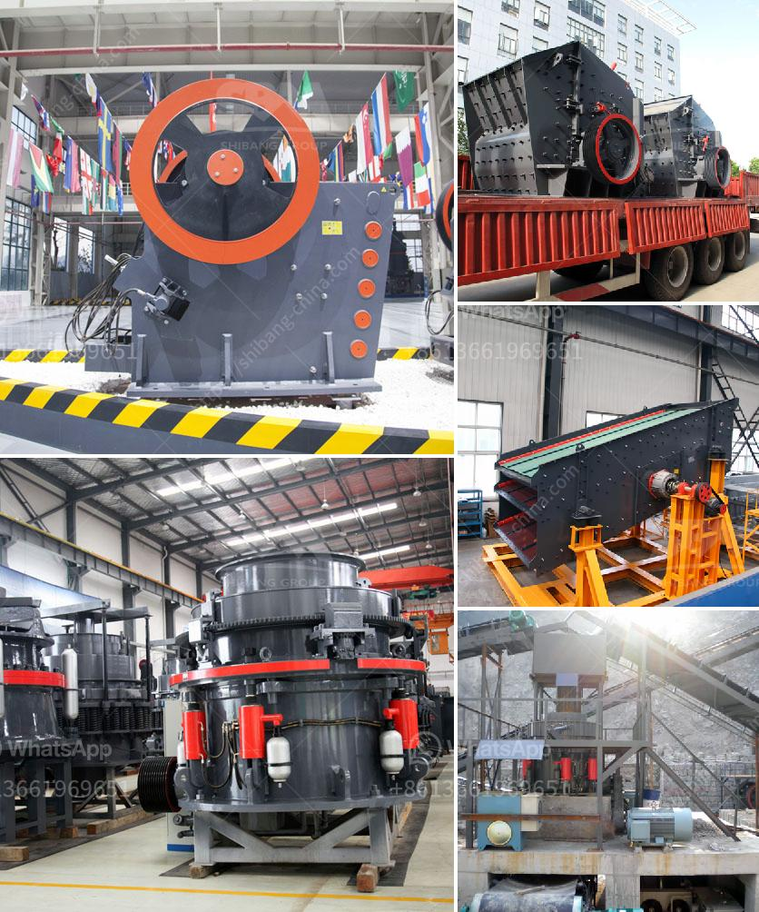

<h3>jaw crusher ghana quarry plant</h3>
Ghana is a country located in West Africa, known for its rich natural resources such as gold, timber, cocoa, diamond, and bauxite. Its economy relies mainly on agriculture, mining, and manufacturing industries. The mining industry, in particular, has been a significant contributor to the country's economy, attracting both local and foreign investors.

One important equipment used in the mining industry is the jaw crusher. A jaw crusher, also referred to as a crusher, is a machine that breaks down large stones into smaller pieces. It helps to reduce the size of aggregate materials, ensuring their suitability for various construction purposes.

In Ghana, there are numerous quarry plants that heavily rely on jaw crushers for their operations. Businesses in the quarrying industry often utilize jaw crushers as primary crushers due to their durability and high efficiency. These machines are capable of handling various types of materials, ranging from granite, limestone, basalt, and sandstone to different ore types.

The jaw crushers in Ghana's quarry plants are designed to be heavy-duty and able to withstand high crushing forces. The jaw plates are made from high manganese steel to withstand the abrasiveness of the processed material.

The quarrying industry requires efficient and reliable equipment to achieve optimal production outcomes. With a jaw crusher, the quarry plant operators can easily improve their productivity and reduce downtime. The ability to handle a wide range of materials with varying hardness levels makes the jaw crusher an ideal choice for Ghana's quarry plants.

Additionally, jaw crushers have a simple design and easy maintenance, reducing the overall operation costs of the quarry plant. Regular maintenance and proper lubrication of the machine ensure its longevity and efficient performance.

As Ghana continues to develop its mining industry, quarry plants with jaw crushers will continue to play a crucial role in extracting and processing raw materials. These machines are essential for meeting the construction needs of the country and contributing to its economic growth.

In conclusion, jaw crushers are indispensable equipment in Ghana's quarry plants. Their ability to handle different types of materials with ease, high efficiency, and low maintenance requirements make them a valuable asset for any quarrying operation. With the increasing demand for construction materials, the jaw crusher will continue to be a vital component in Ghana's mining industry.
<h3>Contact us</h3><ul><li><strong>Whatsapp:&nbsp;<a href="https://wa.me/8613661969651">+8613661969651</a></strong></li><li><a href="https://swt.shibang-china.com/?git&amp;zhl&amp;jaw crusher ghana quarry plant"><strong>Online Service(chat now)</strong></a></li></ul><h3>Related</h3><ul><li><a href='buy gold crusher machine.md'>buy gold crusher machine</a></li><li><a href='mining tenders in south africa.md'>mining tenders in south africa</a></li><li><a href='petroleum coke crushing plant.md'>petroleum coke crushing plant</a></li><li><a href='stone crusher capsule.md'>stone crusher capsule</a></li><li><a href='gypsum board manufacturing machine.md'>gypsum board manufacturing machine</a></li></ul>