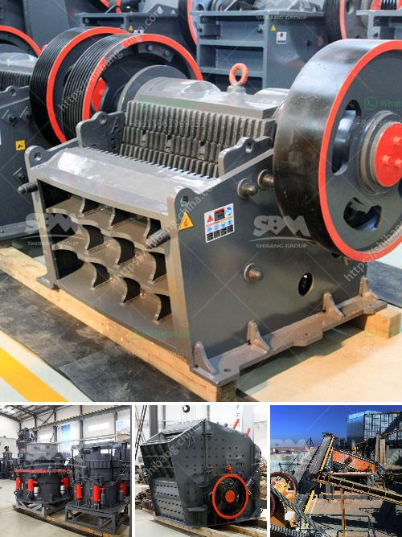

<h3>jaw crusher grinding</h3>
The jaw crusher is a commonly utilized equipment in the mining industry due to its ability to crush materials of various hardness levels. The process of grinding occurs in a clockwise direction, whereas the crushing action occurs in an anti-clockwise direction. This allows for a more efficient crushing process as the feed material is crushed and ground simultaneously.

The grinding process with a jaw crusher involves two major steps. In the first step, the raw material is crushed by the jaw crusher to a size that can enter the grinding chamber. Once the material is crushed, it is then passed through the grinding chamber where the grinding plates, made of high-quality hardened steel, grind the material into the desired size.

Compared to other grinding equipment, the jaw crusher offers several advantages. One of the major advantages is its versatility. The jaw crusher can handle a wide range of materials, from soft to extremely hard and abrasive materials. This makes it suitable for various applications in the mining industry, such as crushing hard rocks, ores, and minerals.

Another advantage of the jaw crusher is its simplicity in operation. The process of grinding with a jaw crusher is straightforward, requiring minimal training and expertise. It is a user-friendly piece of equipment that can be easily operated by personnel with basic knowledge.

Furthermore, the jaw crusher offers a high capacity for processing large amounts of material. Its robust design allows for the efficient reduction of size, resulting in a higher throughput rate. This makes the jaw crusher a suitable choice for industries requiring high production rates.

In conclusion, the jaw crusher is a versatile and efficient piece of equipment for grinding and crushing operations. With its simplicity in operation, versatility, and high capacity, it is a valuable tool in the mining industry. Whether processing soft materials or hard rocks, the jaw crusher delivers optimum performance, making it an essential equipment for any mining operation.
<h3>Contact us</h3><ul><li><strong>Whatsapp:&nbsp;<a href="https://wa.me/8613661969651">+8613661969651</a></strong></li><li><a href="https://swt.shibang-china.com/?git&amp;zhl&amp;jaw crusher grinding"><strong>Online Service(chat now)</strong></a></li></ul><h3>Related</h3><ul><li><a href='pe 200 x 300 stone crusher.md'>pe 200 x 300 stone crusher</a></li><li><a href='gypsum board plant in richmond hill.md'>gypsum board plant in richmond hill</a></li><li><a href='primary crusher machine.md'>primary crusher machine</a></li><li><a href='mining ball mill.md'>mining ball mill</a></li><li><a href='price of conveyor belts.md'>price of conveyor belts</a></li></ul>