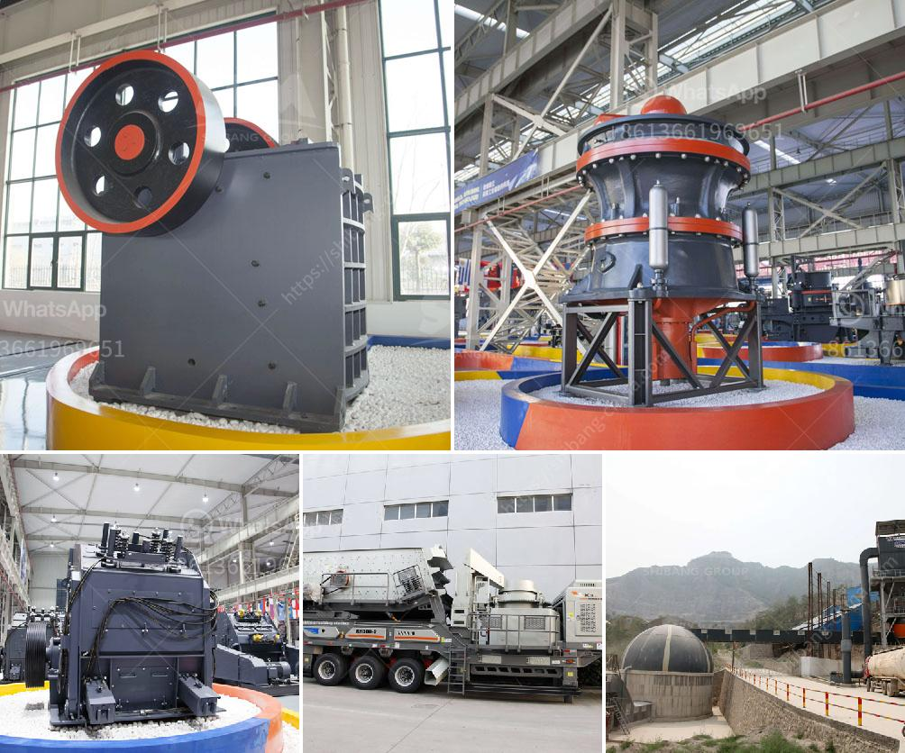

<h3>jaw crusher in nigeria</h3>
The mining industry in Nigeria is one of great potential. It is however only just developing. Small-scale mining is an integral part of mining in Nigeria, which can contribute to local and regional development. Jaw crusher, as a highly efficient mining machine, plays a crucial role in the mining industry in Nigeria.

Nigeria has jaw crushers primarily for reducing various kinds of stones and lump materials into medium-grained gravel. The materials to be crushed can be hard, medium-hard and soft minerals whose compressive strength should be not more than 320 MPa. The jaw crusher has been the cornerstone of the mining industry for many years due to its simple structure, reliability, and versatility.

One of the main advantages of jaw crushers is their ability to process large amounts of material efficiently. For example, a jaw crusher can handle rocks up to 800mm in size. Compared to other types of crushers, jaw crushers have a relatively low production capacity, however, because of their versatility and low operating costs, they are still widely used in the mining industry.

Another advantage of jaw crushers is that they are capable of producing a wide range of particle sizes. This feature is particularly beneficial in industries such as construction, where different sizes of aggregate materials are required.

In Nigeria, jaw crushers are used mainly in primary crushing stages of medium-hard to very hard materials such as granite, basalt, gneiss, quartzite and limestone. They are also used in secondary crushing stages of stone materials in many aggregate production plants. Jaw crushers can be operated either in stationary or mobile applications.

Furthermore, jaw crushers in Nigeria can be used for various materials, including brittle, tough, and hard materials such as quartz, basalt, feldspar, limestone, and granite. These crushers are also ideal for processing construction waste, demolition waste, and recycling applications.

Jaw crushers have become an essential tool for the mining industry in Nigeria. With large deposits of minerals such as limestone, granite, and basalt in Nigeria, the country has the potential to become one of the leading mining nations in the world.

In conclusion, jaw crushers are a reliable and versatile crushing solution for the mining industry in Nigeria. They are capable of processing various types of materials and producing a wide range of particle sizes. With proper maintenance and routine inspections, jaw crushers can provide years of efficient and reliable operation in the mining industry.
<h3>Contact us</h3><ul><li><strong>Whatsapp:&nbsp;<a href="https://wa.me/8613661969651">+8613661969651</a></strong></li><li><a href="https://swt.shibang-china.com/?git&amp;zhl&amp;jaw crusher in nigeria"><strong>Online Service(chat now)</strong></a></li></ul><h3>Related</h3><ul><li><a href='stone crushers for sale uk finance.md'>stone crushers for sale uk finance</a></li><li><a href='type of stone crushers.md'>type of stone crushers</a></li><li><a href='bazer stone crusher.md'>bazer stone crusher</a></li><li><a href='brushes for conveyor belts.md'>brushes for conveyor belts</a></li><li><a href='vertical mill mining.md'>vertical mill mining</a></li></ul>