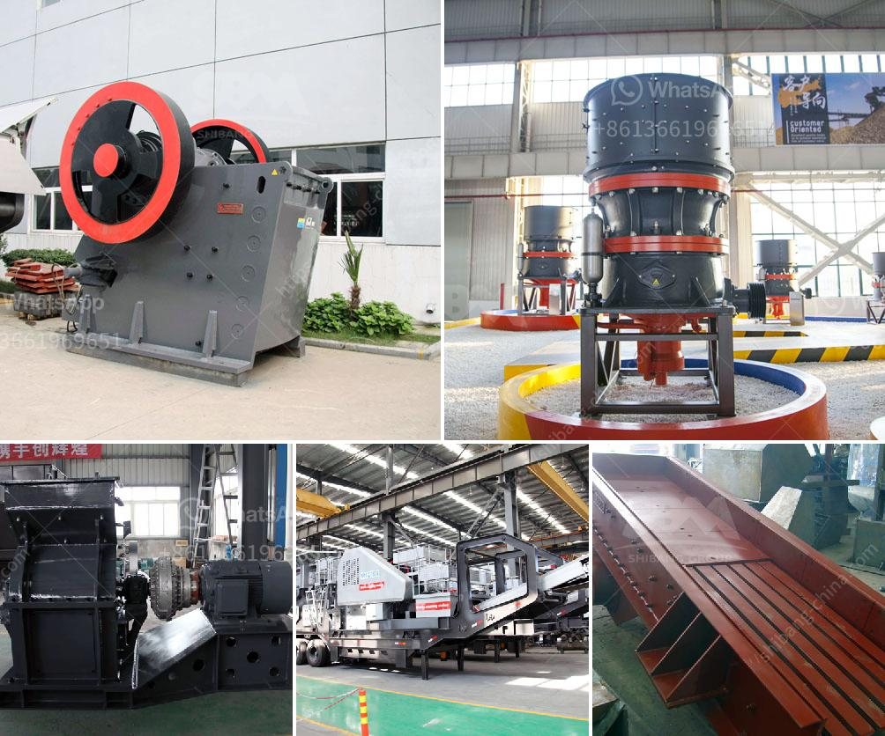

<h3>jaw crusher indonesia agent</h3>
Jaw crusher is a machine or tool widely used in the mining industry in general placement outdoors. A one-use equipment at the time of the destruction of the first stage and the second stage. Has the power to destroy the anti-pressure high up the material can reach 320Mpa.

Jaw Crusher itself is widely used in the mining industry, and has been recognized by the public for its stable performance and long service life. It is widely used in the primary crushing of various ores and bulk materials in mining, smelting, building materials, highway, railway, water conservancy, and chemical industries.

To meet the needs of customers, the jaw crusher manufacturer in Indonesia has developed a new type of jaw crusher, namely European type jaw crusher, which has the characteristics of low power consumption and high output. This machine has high crushing ratio, reliable operation, and easy maintenance.

Another popular jaw crusher is the PE jaw crusher. It is an ideal primary crusher and is also suitable for secondary crushing. The jaw crusher (PE Series) is suitable for primary crushing. It has the characteristics of large crushing ratio, uniform product size, simple structure, reliable work, simple maintenance, and economical operation.

To further improve the performance of the jaw crusher, the manufacturer needs to improve the equipment structure, reduce the excessive weight of the equipment, reduce power consumption, and improve the crushing capacity.

To achieve this goal, manufacturers should add lubrication devices and cooling devices to improve equipment operation and reduce equipment wear. A better solution is to use an independent lubrication system that automatically delivers lubricating oil to the equipment before starting, thus ensuring the normal operation of the equipment and extending its service life.

To improve crushing efficiency and reduce power consumption, the manufacturer should optimize the crushing cavity structure of the jaw crusher, analyze the force distribution of the crushing cavity, and check whether the equipment is suitable for crushing hard materials.

As for the improvement of the crushing capacity of the jaw crusher, the manufacturer should increase the crusher's eccentric shaft speed. This can effectively increase the processing capacity of the equipment, thus achieving higher production efficiency and meeting the needs of customers.

To better serve customers, many jaw crusher manufacturers have set up special agencies in Indonesia to provide better after-sales service for customers. These agencies not only provide equipment sales, but also provide comprehensive technical support, including equipment installation, commissioning, and equipment maintenance.

In conclusion, the jaw crusher is the best choice for limestone crushing in Indonesia. It is a new type of jaw crusher viewed as a primary crusher in the demanding market. It is a continuous innovation in the development of the mining industry and the improvement of crushing efficiency.
<h3>Contact us</h3><ul><li><strong>Whatsapp:&nbsp;<a href="https://wa.me/8613661969651">+8613661969651</a></strong></li><li><a href="https://swt.shibang-china.com/?git&amp;zhl&amp;jaw crusher indonesia agent"><strong>Online Service(chat now)</strong></a></li></ul><h3>Related</h3><ul><li><a href='small impact crusher 100 mesh.md'>small impact crusher 100 mesh</a></li><li><a href='stone crushers made in china.md'>stone crushers made in china</a></li><li><a href='basalt manufacturing plant.md'>basalt manufacturing plant</a></li><li><a href='vertical mill cement.md'>vertical mill cement</a></li><li><a href='business proposal sample for gold milling.md'>business proposal sample for gold milling</a></li></ul>