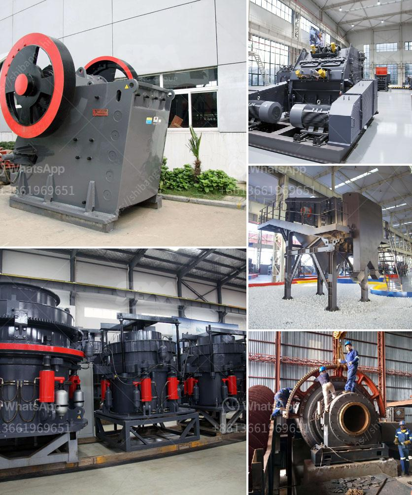

<h3>jaw crusher machine in saudi</h3>
Jaw crusher machines are used for crushing rocks and stones in quarries and mines. They are utilized in construction, chemical, and mining industries. These machines are capable of breaking down large rocks into smaller pieces for further processing or transportation. Saudi Arabia possesses large deposits of various minerals, including bauxite, copper, gold, iron, lead, silver, tin, and non-metallic minerals. Mining crushing plant has wide applications there. The introduction of modern mining and extraction methods has once again made the mine a major producer of precious metals.

Efficient Operation: Jaw crusher machines are designed to work in harmony with each other. This allows them to produce high-quality construction materials in a cost-effective manner. The machine operates smoothly, reducing downtime and increasing productivity.

Versatility: Jaw crusher machines are used for primary and secondary crushing of materials. They can handle a wide range of materials, including minerals, rocks, and ores. This makes them suitable for various applications in different industries.

High Crushing Ratio: The jaw crusher machine has a specific crushing ratio. This means that the size of the materials entering the machine is reduced to a specific ratio before being discharged. This ensures that the final product is of the required size and shape.

Durability: Jaw crusher machines are built using high-quality materials, ensuring their longevity and durability. They are designed to withstand heavy-duty operations, such as crushing stones and rocks. This makes them a reliable and cost-effective choice for the mining industry.

Easy Maintenance: Jaw crusher machines require minimal maintenance, reducing the overall operational costs. Regular maintenance and inspection can extend the life of the machine, ensuring optimal performance.

Environmental Friendly: The jaw crusher machine is designed to produce minimal dust and noise pollution, ensuring a clean and quiet working environment. This is crucial in the mining industry to comply with strict environmental regulations.

Jaw crusher machines are reliable, efficient, and versatile machines used in the mining industry in Saudi Arabia. They are designed to crush a variety of materials, such as rocks, ores, and minerals, into smaller pieces. This minimizes the need for transportation and provides the construction industry with high-quality construction materials.

The efficiency and durability of jaw crusher machines make them a cost-effective choice for mining operations. They are designed to work in harmony with other machines, ensuring efficient and smooth operations. Additionally, their low maintenance requirements contribute to the overall cost-effectiveness.

Jaw crusher machines have a high crushing ratio and are capable of producing construction materials of the required size and shape. This makes them suitable for various applications in different industries.

Furthermore, the environmental-friendly design of jaw crusher machines ensures minimal dust and noise pollution. Compliance with environmental regulations is essential for sustainable mining operations.

Overall, jaw crusher machines are highly beneficial in the mining industry in Saudi Arabia. They provide efficient and cost-effective solutions for the crushing and processing of minerals, rocks, and ores.
<h3>Contact us</h3><ul><li><strong>Whatsapp:&nbsp;<a href="https://wa.me/8613661969651">+8613661969651</a></strong></li><li><a href="https://swt.shibang-china.com/?git&amp;zhl&amp;jaw crusher machine in saudi"><strong>Online Service(chat now)</strong></a></li></ul><h3>Related</h3><ul><li><a href='pe series jaw crusher and ton per day.md'>pe series jaw crusher and ton per day</a></li><li><a href='beneficiation plant process line diagram.md'>beneficiation plant process line diagram</a></li><li><a href='crusher hydroponic cone crusher.md'>crusher hydroponic cone crusher</a></li><li><a href='stone crusher turkey.md'>stone crusher turkey</a></li><li><a href='nigeria vertical mill machine.md'>nigeria vertical mill machine</a></li></ul>