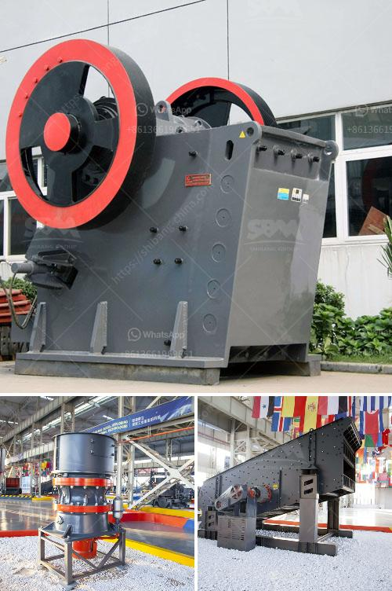

<h3>jaw crusher manufacturer germany</h3>
When it comes to the construction and mining industry, efficiency is essential. With the growing demand for innovative and reliable equipment, the need for jaw crushers and other crushing machinery is increasing. Germany is one of the leading global manufacturers of high-quality and reliable crushers, including jaw crushers, cone crushers, and impact crushers. 

Jaw crushers are versatile crushing machines that are widely used in mines, aggregate quarries, recycling applications, and more. Jaw crushers are widely used in the mining and construction industry due to their ability to crush hard materials and their durability. However, not all jaw crushers are created equal. 

One German company that specializes in the manufacturing of jaw crushers is Kleemann GmbH. Kleemann GmbH is part of the Wirtgen Group, a globally recognized company that provides equipment for the road construction and mining industry. Over the years, Kleemann GmbH has built a reputation as a reliable and innovative manufacturer of crushers that are engineered to deliver superior performance and durability. 

Kleemann's jaw crushers are known for their heavy-duty construction, which ensures high durability and reliability. Their crushers are designed to handle tough materials, such as granite, basalt, iron ore, and other hard rocks. Kleemann's innovative jaw crushers come with advanced features, such as hydraulic systems for easy adjustment of the crusher setting, remote control operation, and monitoring systems to ensure optimal performance and reduced downtime. 

The advanced technology and engineering expertise of Kleemann allow them to continuously improve their jaw crushers and meet the evolving needs of the industry. Whether it is improving crushing capacity, reducing energy consumption, or enhancing safety features, Kleemann is committed to providing innovative solutions to their customers. 

In addition to their technical expertise, Kleemann also prioritizes sustainability in their manufacturing processes. They strive to minimize the environmental impact by using recyclable materials and implementing energy-efficient technologies. Kleemann's commitment to sustainability goes beyond manufacturing, as they also provide training to their customers on efficient operation and maintenance of their crushers, which helps to extend their lifespan and reduce waste. 

Kleemann's reputation as a jaw crusher manufacturer Germany can be attributed to their commitment to quality and customer satisfaction. They understand that investing in a crusher is a significant decision for their customers, and they strive to provide the best products and support to meet their needs. With a global network of dealers, Kleemann ensures prompt delivery, reliable after-sales service, and spare parts availability. 

In conclusion, Germany is a global leader in the manufacturing of high-quality crushers, including jaw crushers. Kleemann GmbH, a part of the Wirtgen Group, stands out as a reliable and innovative manufacturer that delivers superior performance and durability. With their advanced technology and commitment to sustainability, Kleemann continues to set the benchmark in the industry. Whether it is for mining, quarrying, or recycling applications, Kleemann's jaw crushers are a reliable choice for the construction and mining industry.
<h3>Contact us</h3><ul><li><strong>Whatsapp:&nbsp;<a href="https://wa.me/8613661969651">+8613661969651</a></strong></li><li><a href="https://swt.shibang-china.com/?git&amp;zhl&amp;jaw crusher manufacturer germany"><strong>Online Service(chat now)</strong></a></li></ul><h3>Related</h3><ul><li><a href='ballast ore crusher for sale in kenya.md'>ballast ore crusher for sale in kenya</a></li><li><a href='standard cone crusher.md'>standard cone crusher</a></li><li><a href='safety videos of belt conveyors in hindi.md'>safety videos of belt conveyors in hindi</a></li><li><a href='stone crushing machine in kenya.md'>stone crushing machine in kenya</a></li><li><a href='crushing equipment for rent.md'>crushing equipment for rent</a></li></ul>