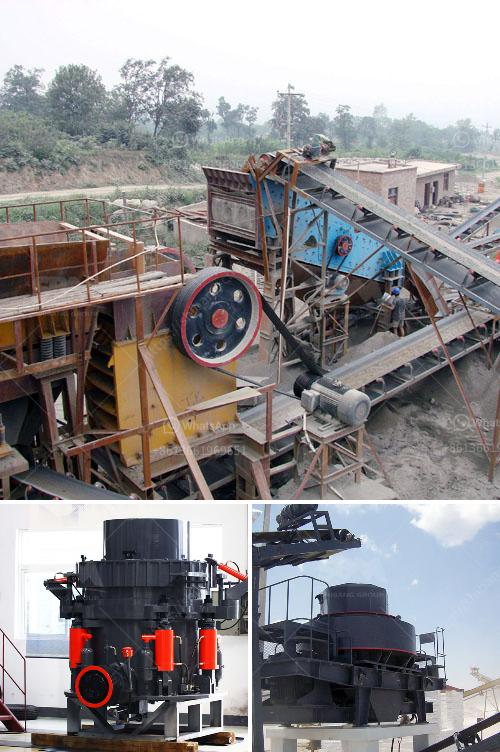

<h3>jaw crusher manufacturer in china</h3>
China is a country rich in mineral resources and has a thriving mining industry. As an important part of the mining machinery industry, the jaw crusher plays a very important role in China's economic development.

Jaw crusher is widely used in mining, metallurgy, building materials, transportation, ceramics, chemical industry, electric power, infrastructure, and other fields. It has the advantages of simple structure, reliable operation, easy maintenance, and low operation cost. It is favored by domestic and foreign customers.

There are many jaw crusher manufacturers in China, of which, HXJQ is a trusted and reliable brand. They offer a high-performing, rugged type of primary crushers in the market. Their thumb-rules for indicating such HXJQ crushers are being followed across nearly all infrastructure projects in the country.

HXJQ has a long history and is devoted to the research and development of various crushing equipment. They have a team of engineers with professional knowledge, years of practical experience, and a great deal of technical accumulation. They have mastered mature and stable manufacturing processes and manufacturing facilities.

HXJQ jaw crushers are made of high-quality wear-resistant materials, with more durable and efficient crushing capacity, higher production efficiency, lower noise, and various types to meet the diverse needs of different customers. They also have advanced technology and rich experience in crushing industry, providing the best service to customers.

In recent years, with the continuous development of China's infrastructure construction and mining industry, jaw crushers are constantly evolving and improving. HXJQ jaw crusher manufacturer always insists on optimizing and improving the product performance and technical parameters to meet the market demand and bringing convenience to each customer.

HXJQ is a professional jaw crusher manufacturer, committed to producing the best jaw crusher equipment available in the market. They can be used in various industries, including mining, building materials, chemical industry, metallurgy, transportation, ceramics, water conservancy and so on. Trustworthy jaw crusher manufacturer capabilities ensure product quality and provide after-sales service. With their years of experience in the field, HXJQ is poised to excel in the industry and become a household name in China.
<h3>Contact us</h3><ul><li><strong>Whatsapp:&nbsp;<a href="https://wa.me/8613661969651">+8613661969651</a></strong></li><li><a href="https://swt.shibang-china.com/?git&amp;zhl&amp;jaw crusher manufacturer in china"><strong>Online Service(chat now)</strong></a></li></ul><h3>Related</h3><ul><li><a href='laboratory grinding mills jaw crushers.md'>laboratory grinding mills jaw crushers</a></li><li><a href='overland conveyor belt system cost estimates.md'>overland conveyor belt system cost estimates</a></li><li><a href='roller mill famsun.md'>roller mill famsun</a></li><li><a href='cost of setting up quarry plant in nigeria.md'>cost of setting up quarry plant in nigeria</a></li><li><a href='ball mill maintenance seminar.md'>ball mill maintenance seminar</a></li></ul>