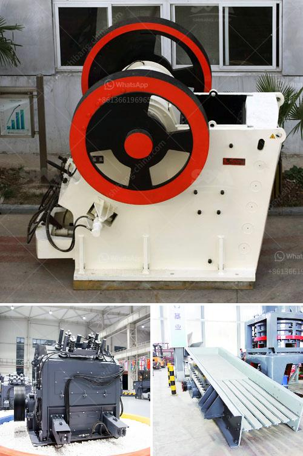

<h3>jaw crusher manufacturer</h3>
Jaw crushers are widely used in the mining and construction industry due to their ability to crush hard materials efficiently. A jaw crusher compresses large rocks or ore by placing the rock under compression. Stone crusher manufacturers for sand, quarry, mining, and construction. JXSC mine machinery factory set up in 1985 which has three series machines. The crushing machine, sand making machine and mineral processing equipment. The types of stone crushers are cone crusher, jaw crusher, impact crusher, and mobile rock crushing. We supply cost-effective products and first-class service, solutions, support for customers. Our factory has an area of 10000 square meters, fixed assets of 6 million Yuan, with engineer and technical personnel covering 15% of the total staff. Here are some details about our factory and equipment.

The production of jaw crushers has a history of more than 100 years. Nowadays, jaw crusher manufacturer in the world can produce high-quality crushers that meet the international standard. Moreover, the crushing equipment developed by these manufacturers is known for its reliability and durability. The advanced technology and design of the jaw crushers ensure efficient and reliable operation. These crushers have a variety of applications, including quarrying, mining, construction, and recycling. Their ability to crush hard materials makes them suitable for a wide range of operations.

As a reputable jaw crusher manufacturer, we produce high-quality crushers that are suitable for different industrial applications. Our range of jaw crushers is designed to offer superior performance and durability while minimizing operational costs. With a focus on reducing production downtime and maintenance costs, we ensure that our jaw crushers deliver maximum productivity and efficiency. Additionally, we offer customization options to meet specific customer requirements.

At our manufacturing facility, we have a team of experienced engineers and technicians who design and oversee the production process. We use the latest technology and ensure strict quality control measures at every stage of production. Our commitment to delivering high-quality products has made us one of the leading jaw crusher manufacturers globally.

In conclusion, choosing a reliable jaw crusher manufacturer is vital for obtaining high-quality equipment that meets your requirements. With years of experience and expertise, our company specializes in providing top-notch jaw crushers that offer exceptional performance and durability. Contact us today to learn more about our products and services.
<h3>Contact us</h3><ul><li><strong>Whatsapp:&nbsp;<a href="https://wa.me/8613661969651">+8613661969651</a></strong></li><li><a href="https://swt.shibang-china.com/?git&amp;zhl&amp;jaw crusher manufacturer"><strong>Online Service(chat now)</strong></a></li></ul><h3>Related</h3><ul><li><a href='small ball mill for cement clinker grinding india.md'>small ball mill for cement clinker grinding india</a></li><li><a href='jaw crusher type sp 100 x.md'>jaw crusher type sp 100 x</a></li><li><a href='malaysia conveyor belts.md'>malaysia conveyor belts</a></li><li><a href='mill crusher pigment manufacturer in kenya.md'>mill crusher pigment manufacturer in kenya</a></li><li><a href='impact crusher for sale in saudi arabia.md'>impact crusher for sale in saudi arabia</a></li></ul>