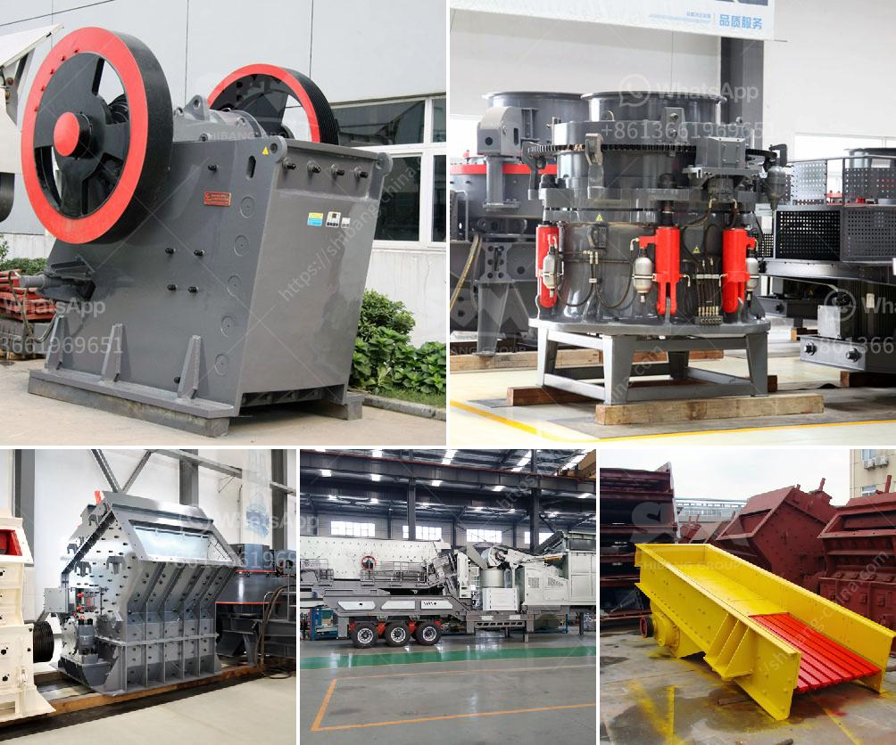

<h3>jaw crusher type sp 100 x</h3>
The jaw crusher type SP-100 x 100 is a small but powerful jaw crusher designed for the rapid crushing of hard and brittle materials. It has high efficiency and low operating costs, making it ideal for sample preparation in laboratories and industrial plants.

1. High crushing ratio: The 4″ x 5″ 911MPEJC100 Jaw Crusher is designed for batch and continuous crushing of middle hard, hard brittle and tough materials for the following fine grinding.

2. Easy adjustment: This jaw crusher is easily adjustable by means of simple hand wheel adjustment. The jaw plates are easily replaceable on site.

3. Convenient maintenance: All parts of the jaw crusher can be easily dismantled for cleaning using a basic tool kit. This ensures effective and efficient maintenance procedures, reducing downtime and increasing productivity.

4. Durable construction: The SP-100 x 100 jaw crusher is made from high-quality steel and features hardened steel jaws, which guarantee a long service life and reliable performance.

5. Compact design: The jaw crusher is small in size and lightweight, making it the perfect choice for laboratories and small-scale crushing applications. It can easily fit into tight spaces or be mounted on a stand for added stability.

The SP-100 x 100 jaw crusher is packed with several safety features that contribute to its smooth operation and long lifespan. It is equipped with a lubrication system that ensures continuous and proper oil circulation to the bearings. The overload protection feature prevents damage to the crusher in the event of non-crushable materials or tramp metal entering the crushing chamber.

The jaw crusher can be operated manually or through an automated control system for user convenience. It is widely used in various industries such as mining, metallurgy, building materials, ceramics, and coal research. The high crushing capacity and efficiency make it suitable for both laboratory and production environments.

In conclusion, the jaw crusher type SP-100 x 100 is a reliable and efficient crushing device that provides unmatched performance. Its compact design, easy maintenance, and rugged construction make it the ideal choice for crushing hard and brittle materials. Whether used in a laboratory or industrial setting, this jaw crusher delivers consistent results and ensures a high level of productivity.
<h3>Contact us</h3><ul><li><strong>Whatsapp:&nbsp;<a href="https://wa.me/8613661969651">+8613661969651</a></strong></li><li><a href="https://swt.shibang-china.com/?git&amp;zhl&amp;jaw crusher type sp 100 x"><strong>Online Service(chat now)</strong></a></li></ul><h3>Related</h3><ul><li><a href='price of conveyor belts.md'>price of conveyor belts</a></li><li><a href='impact crusher suppliers italy.md'>impact crusher suppliers italy</a></li><li><a href='china raymond mill company.md'>china raymond mill company</a></li><li><a href='limestone grinding equipment.md'>limestone grinding equipment</a></li><li><a href='crusher industrial jaw crusher information.md'>crusher industrial jaw crusher information</a></li></ul>