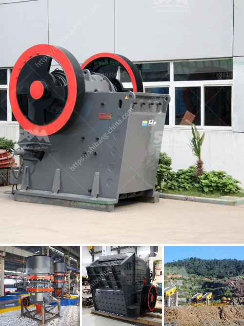

<h3>jaw crusher used in thailand</h3>
When it comes to transportation infrastructure projects in Thailand, a jaw crusher plays a vital role. This heavy-duty machine is designed to reduce large-sized rocks into smaller sizes for further processing. At the heart of every jaw crusher is a fixed jaw mounted in a V-shaped alignment, with an inclined plate to help crush rocks during operation. The movable jaw exerts force against these fixed jaws, crushing the rocks between them.

Thailand's reliance on jaw crushers can be attributed to the country's booming mining industry. As the demand for minerals and precious metals continues to grow, miners must extract the resources efficiently and economically. Jaw crushers offer them the perfect solution, as they are capable of handling hard and abrasive materials.

To further aid in their efficiency, jaw crushers in Thailand are equipped with a range of advanced features. These include hydraulic adjustment systems, which allow for quick and easy changes to the crusher's setting, resulting in higher productivity and reduced downtime. Additionally, some jaw crushers feature a toggle plate that helps to transmit crushing forces, protecting the machine from overloading and ensuring its long-term reliability.

One of the significant advantages of jaw crushers is their versatility. They can be used in various applications, such as construction, aggregate production, and mining. In Thailand, these machines are frequently employed in quarrying operations to process different types of rocks, including granite, limestone, and basalt.

To meet the specific needs of different industries, jaw crushers are available in various sizes and capacities. Whether it is a small-scale mining project or a large-scale infrastructure development, there is a jaw crusher suitable for the job.

In conclusion, jaw crushers are an essential tool in Thailand's mining industry. Their ability to crush hard and abrasive materials, coupled with their versatility and advanced features, make them a reliable choice for various applications. As the demand for minerals grows, the jaw crusher's importance in Thailand's mining sector is expected to continue to rise.
<h3>Contact us</h3><ul><li><strong>Whatsapp:&nbsp;<a href="https://wa.me/8613661969651">+8613661969651</a></strong></li><li><a href="https://swt.shibang-china.com/?git&amp;zhl&amp;jaw crusher used in thailand"><strong>Online Service(chat now)</strong></a></li></ul><h3>Related</h3><ul><li><a href='crushing equipment for rent.md'>crushing equipment for rent</a></li><li><a href='manufacturer of coal processing equipment.md'>manufacturer of coal processing equipment</a></li><li><a href='micron grinding unit menufacture plant in bewar.md'>micron grinding unit menufacture plant in bewar</a></li><li><a href='features a hammer mill.md'>features a hammer mill</a></li><li><a href='mobile crusher plant price in india.md'>mobile crusher plant price in india</a></li></ul>