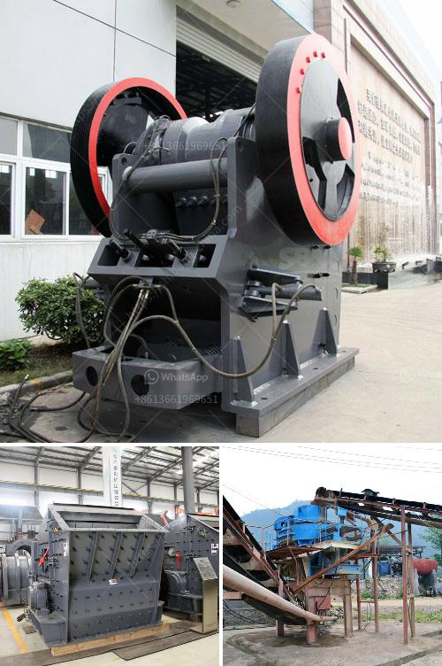

<h3>jaw crusher vibration analysis pdf</h3>
A jaw crusher, as the name suggests, is a machine that breaks down materials by crushing them. Jaw crushers are widely used in various industries such as mining, construction, and recycling. They are commonly used to crush rock and various types of ores, such as granite, limestone, basalt, and more. Jaw crushers are popular due to their ability to crush hard materials without causing any unwanted vibrations.

However, despite their efficiency and quality, jaw crushers can experience vibrations during operation. These vibrations can cause various issues, such as damage to the machine and reduced production capacity. It is crucial to analyze and understand these vibrations to ensure the optimal performance of a jaw crusher.

Vibration analysis is a powerful tool used to identify and quantify the sources of vibrations. By measuring and analyzing vibrations, engineers can determine the root causes of the problem and implement appropriate solutions. In the case of jaw crushers, this analysis is often performed using accelerometers attached to the machine's frame.

One common cause of vibrations is unbalance. Over time, the jaws of a jaw crusher can wear down, causing an imbalance in the machine's rotation. This imbalance can generate vibrations that can be felt by the operator or even measured by vibration analysis equipment. Additionally, the improper installation of the jaws can also lead to unbalance and subsequent vibrations.

Another cause of vibrations in a jaw crusher is worn-out bearings. These bearings are subjected to high loads and intense impact forces during the crushing process. Over time, the bearings can wear down, leading to increased friction and vibrations. Regular inspection and maintenance of the bearings can help prevent such issues.

Furthermore, misalignment of the crusher's components can also cause vibrations. If the components, such as the flywheel and motor, are not correctly aligned, it can result in uneven distribution of forces and generate vibrations. Regular inspection and adjustment of these components can minimize vibrations and ensure smooth operation.

In conclusion, jaw crusher vibration analysis is essential for the optimal performance of a jaw crusher. By analyzing the vibrations and identifying the root causes of the problem, engineers can implement appropriate solutions to prevent further damage and increase the machine's lifespan. Regular inspection and maintenance of the crusher's components, such as bearings and jaws, can help minimize vibrations and extend the machine's efficiency. Therefore, it is crucial for operators and maintenance personnel to be aware of the potential issues related to vibrations in jaw crushers and to take the necessary steps to address them promptly.
<h3>Contact us</h3><ul><li><strong>Whatsapp:&nbsp;<a href="https://wa.me/8613661969651">+8613661969651</a></strong></li><li><a href="https://swt.shibang-china.com/?git&amp;zhl&amp;jaw crusher vibration analysis pdf"><strong>Online Service(chat now)</strong></a></li></ul><h3>Related</h3><ul><li><a href='ultra fine grinding mills.md'>ultra fine grinding mills</a></li><li><a href='quartz crushing process.md'>quartz crushing process</a></li><li><a href='mobile crushers for sale south africa.md'>mobile crushers for sale south africa</a></li><li><a href='quartz making machine.md'>quartz making machine</a></li><li><a href='small jaw crusher uk.md'>small jaw crusher uk</a></li></ul>