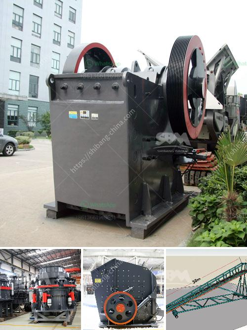

<h3>jaw crushers kyrgyzstan</h3>
Kyrgyzstan, also known as the Kyrgyz Republic, is a landlocked country located in Central Asia. With its stunning mountain landscapes and rich cultural heritage, it is a popular destination for tourists. However, behind its natural beauty, Kyrgyzstan is also home to a thriving mining industry, with jaw crushers playing a crucial role in the stone crushing process.

Jaw crushers are mechanical devices that are primarily used for crushing rocks and ores. They are widely utilized in mining, construction, and various other industries where the material needs to be reduced in size for subsequent processing. These robust machines consist of a fixed jaw and a moving jaw, with the material being crushed between them.

In Kyrgyzstan, jaw crushers are extensively used in the mining sector. The country is rich in various minerals, including coal, gold, and uranium. As these natural resources need to be extracted and processed, jaw crushers are employed to break down the large rocks into smaller, manageable sizes. This enables the subsequent stages of mining, such as grinding and pulverizing, to be carried out efficiently.

One of the advantages of jaw crushers is their versatility. They can handle a wide range of materials, from soft to hard rocks, and exhibit high production rates. Whether it is limestone, granite, or even tougher ores like iron and copper, jaw crushers in Kyrgyzstan are capable of crushing them into the desired sizes.

Furthermore, jaw crushers are known for their durability and reliability. This is particularly crucial in Kyrgyzstan's rugged mining environment, where the equipment is subjected to challenging conditions. The robust construction of jaw crushers ensures their ability to withstand heavy-duty applications and provide years of efficient performance.

In conclusion, jaw crushers are essential equipment in Kyrgyzstan's mining industry. They are utilized for the primary crushing of various materials, enabling efficient processing in subsequent stages. With their versatility, durability, and reliability, jaw crushers play a vital role in extracting and processing the country's valuable mineral resources.
<h3>Contact us</h3><ul><li><strong>Whatsapp:&nbsp;<a href="https://wa.me/8613661969651">+8613661969651</a></strong></li><li><a href="https://swt.shibang-china.com/?git&amp;zhl&amp;jaw crushers kyrgyzstan"><strong>Online Service(chat now)</strong></a></li></ul><h3>Related</h3><ul><li><a href='stone crusher for road construction.md'>stone crusher for road construction</a></li><li><a href='cone crusher machine for sale.md'>cone crusher machine for sale</a></li><li><a href='mobile crushing machines.md'>mobile crushing machines</a></li><li><a href='stone crusher specification.md'>stone crusher specification</a></li><li><a href='price of industrial hammer mill.md'>price of industrial hammer mill</a></li></ul>