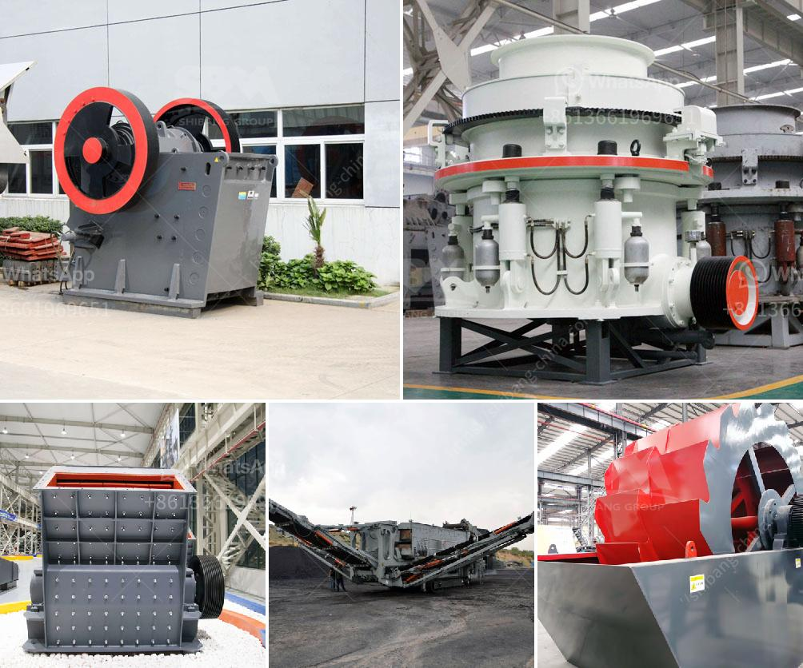

<h3>jaw crushing plant</h3>
A jaw crushing plant is an essential piece of equipment in the mining and construction industry. This plant can help produce gravel, sand, and other desired materials efficiently and quickly. Moreover, it reduces the need for costly transportation and can process waste material into valuable resources. In this article, we will explore the advantages and applications of a jaw crushing plant.

One of the key benefits of a jaw crushing plant is its versatility. It can handle a wide range of materials, including limestone, granite, concrete, asphalt, and more. This makes the plant suitable for various applications, such as road construction, building foundations, and concrete production. Additionally, the plant can be adjusted to different output sizes, allowing operators to produce materials as per their requirements.

The jaw crushing plant consists of a feed hopper, grizzly feeder, jaw crusher, vibrating screen, and conveyor belts. These components work together to provide a continuous feed of raw materials into the crusher and the separated sizes of crushed materials. The grizzly feeder prevents large materials from entering the crusher, ensuring efficient operation and preventing damage to the machine.

One of the key advantages of a jaw crusher is its ability to process hard and abrasive materials. The jaw crusher's sturdy construction and design ensure its durability and withstand heavy-duty operations. The high-powered motor allows the machine to crush even the toughest rocks effortlessly, ensuring high productivity and reduced downtime.

Furthermore, a jaw crushing plant is easy to operate and maintain. Operators can adjust the size of the output material using the crusher's hydraulic setting adjustment system. This feature allows for precise control over the final product, ensuring consistency and quality. Additionally, regular maintenance and servicing ensure the plant's longevity and trouble-free operation.

The jaw crushing plant's portability is another significant advantage. With wheels or tracks, operators can easily move the plant from one site to another, reducing transportation costs and allowing for greater flexibility. This portability is especially beneficial for contractors who need to move their equipment frequently to different locations.

In conclusion, a jaw crushing plant is an indispensable asset for miners and construction companies. Its versatility, robustness, and ability to process a wide variety of materials make it an ideal solution for numerous applications. The plant's portability and easy maintenance further add to its appeal. With a jaw crushing plant, operators can efficiently and cost-effectively produce high-quality materials, contributing to their overall success and profitability.
<h3>Contact us</h3><ul><li><strong>Whatsapp:&nbsp;<a href="https://wa.me/8613661969651">+8613661969651</a></strong></li><li><a href="https://swt.shibang-china.com/?git&amp;zhl&amp;jaw crushing plant"><strong>Online Service(chat now)</strong></a></li></ul><h3>Related</h3><ul><li><a href='costo equipos de la planta de cemento.md'>costo equipos de la planta de cemento</a></li><li><a href='price copper concentration plant.md'>price copper concentration plant</a></li><li><a href='lime mining crusher in india.md'>lime mining crusher in india</a></li><li><a href='basalt processing plant.md'>basalt processing plant</a></li><li><a href='ball mill for solutions.md'>ball mill for solutions</a></li></ul>