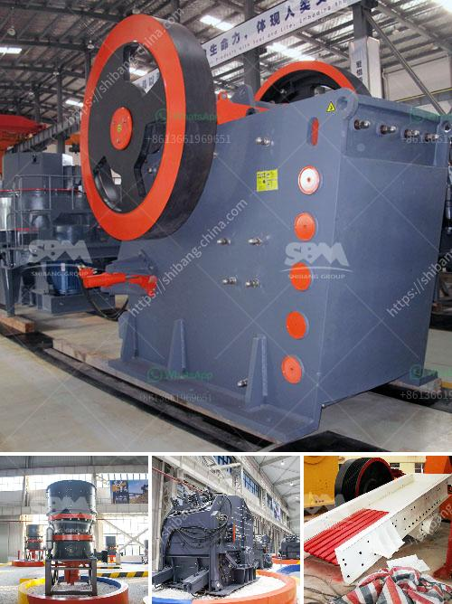

<h3>jual mesin raymond mill</h3>
In today's dynamic world of industry, various machines and equipment play a crucial role in facilitating manufacturing processes. One such machine is the jual mesin Raymond mill. This particular milling machine has garnered significant attention due to its effectiveness and diverse range of applications.

The jual mesin Raymond mill, also known as Raymond mill, is widely used in industries such as mining, metallurgy, building materials, chemicals, and others. It is particularly suitable for processing non-flammable and non-explosive materials with a Mohs hardness of less than seven and a humidity of less than 6%.

One of the major advantages of the jual mesin Raymond mill is its efficient and precise grinding capability. It can crush, dry, grind, and classify materials with high accuracy and uniformity. This results in the production of fine and ultra-fine powder, making it highly desirable in industries that demand precision and quality.

Moreover, the jual mesin Raymond mill offers a wide range of applications. It can be used to process various minerals, such as limestone, calcite, marble, barite, dolomite, potassium feldspar, bentonite, and more. Furthermore, it can also be employed in processing non-metallic ores, such as talc, kaolin, gypsum, and graphite.

The jual mesin Raymond mill is equipped with advanced technology, including a high-pressure suspension roller mill, which improves grinding efficiency and productivity. Additionally, it employs various wear-resistant materials, ensuring a longer lifespan and reduced maintenance costs for operators.

Another significant advantage of the jual mesin Raymond mill is its environmentally friendly nature. It produces low noise, little dust, and operates with high efficiency. As a result, it not only provides a safe working environment for operators but also contributes to a cleaner and healthier atmosphere for the surrounding community.

In conclusion, the jual mesin Raymond mill is a reliable and versatile machine that offers numerous benefits to industries worldwide. With its efficient grinding capabilities, diverse range of applications, advanced technology, and eco-friendly features, it is undoubtedly a valuable asset in the manufacturing process. Whether it's processing minerals or non-metallic ores, the jual mesin Raymond mill is a trusted solution for achieving precision, quality, and efficiency.
<h3>Contact us</h3><ul><li><strong>Whatsapp:&nbsp;<a href="https://wa.me/8613661969651">+8613661969651</a></strong></li><li><a href="https://swt.shibang-china.com/?git&amp;zhl&amp;jual mesin raymond mill"><strong>Online Service(chat now)</strong></a></li></ul><h3>Related</h3><ul><li><a href='used crushers sale usa.md'>used crushers sale usa</a></li><li><a href='china clay processing plant.md'>china clay processing plant</a></li><li><a href='ceramic mortar powder grinding mill in nigeria.md'>ceramic mortar powder grinding mill in nigeria</a></li><li><a href='quartz stone crushers materials.md'>quartz stone crushers materials</a></li><li><a href='price of grinder machine in pakistan.md'>price of grinder machine in pakistan</a></li></ul>