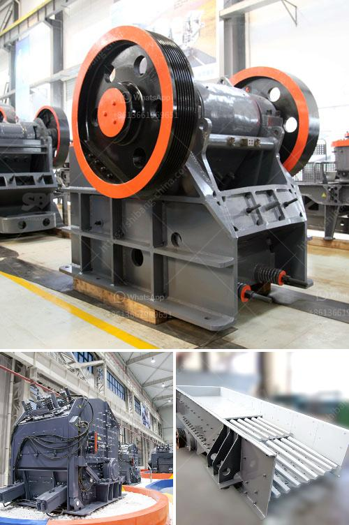

<h3>jual stone crusher mobile cap 30 tph in indonesia</h3>
Stone crushing industry is an important industrial sector in Indonesia. It is primarily used to crush large stones into smaller sizes for construction purposes. There are several types of stone crushing machines available in the market such as jaw crushers, impact crushers, and cone crushers. However, not all stone crushers are capable of meeting the requirements of the industry. This is where the mobile stone crusher cap 30 tph in Indonesia comes into play.

A mobile stone crusher cap 30 tph is available with mobile jaw crushing plant, mobile cone crushing plant, mobile impact crushing plant, and mobile sand making plant. With their compact design and flexibility, it allows for reduced costs of transportation and the ability to crush materials directly on site. It also offers high efficiency, low energy consumption, and even distribution of the final product.

One of the key advantages of the mobile stone crusher cap 30 tph is its ability to move easily from one site to another, providing greater flexibility in terms of production capacity and reducing downtime. It also eliminates the need for costly infrastructure, such as foundations and conveyor systems. This makes it an ideal choice for small to medium-sized construction projects in remote locations.

The mobile stone crusher cap 30 tph is an efficient and versatile machine that is a valuable asset in construction projects. It has exceptional productivity and efficiency, providing an output of up to 35 tons per hour. The fuel-efficient diesel engine is capable of powering the machine for an extended period of time, allowing for increased productivity without the need for constant refueling.

In addition to its excellent performance, the mobile stone crusher cap 30 tph also offers several safety features. It is equipped with a hydraulic release system that prevents damage to the machine in the event of an overload or uncrushable material. It also has a remote control system that allows the operator to easily adjust the crusher settings and track the machine's performance.

In conclusion, the mobile stone crusher cap 30 tph is a valuable investment for any construction company. Its mobility, high productivity, and safety features make it a versatile and efficient machine for crushing stones on construction sites. With its compact design and low operating costs, it provides a cost-effective solution for small to medium-sized construction projects in Indonesia. For all your stone crushing needs, consider investing in a mobile stone crusher cap 30 tph to enhance productivity and profitability in your construction projects.
<h3>Contact us</h3><ul><li><strong>Whatsapp:&nbsp;<a href="https://wa.me/8613661969651">+8613661969651</a></strong></li><li><a href="https://swt.shibang-china.com/?git&amp;zhl&amp;jual stone crusher mobile cap 30 tph in indonesia"><strong>Online Service(chat now)</strong></a></li></ul><h3>Related</h3><ul><li><a href='type of stone crushers.md'>type of stone crushers</a></li><li><a href='4 roller mill for stone.md'>4 roller mill for stone</a></li><li><a href='limestone gypsum crusher machine.md'>limestone gypsum crusher machine</a></li><li><a href='vibro screen machine in ahmedabad.md'>vibro screen machine in ahmedabad</a></li><li><a href='malaysia conveyor belts.md'>malaysia conveyor belts</a></li></ul>