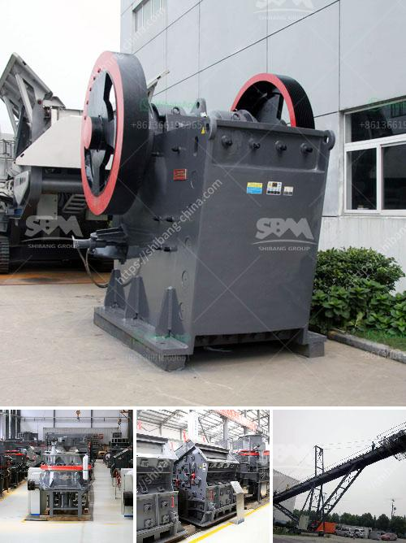

<h3>kaolin crusher processing plant</h3>
Kaolin, also known as china clay, is a white, soft, and plastic clay mineral commonly used in ceramics, paper, paints, coatings, rubber, and many other applications. With the development of modern technology, kaolin crushers can process kaolin into different forms, such as powdered kaolin, calcined kaolin, and surface coated kaolin. This article will focus on kaolin crusher processing plant and the benefits it brings.

Firstly, the kaolin raw material will be crushed by the crusher (usually jaw crusher) to a certain size, which is suitable for the grinding process. Then the crushed kaolin material will be transported to the storage hopper by the elevator, and then evenly sent to the main mill for grinding by the electromagnetic vibrating feeder.

The grinding process is an important step in kaolin processing. It is responsible for the final size reduction and refinement of kaolin particles. The most commonly used grinding mill is the Raymond mill, which is ideal for grinding kaolin. After being grinded, the kaolin powder will be collected by the powder collector and sent to the storage bin through the discharge port. The finished product can be used for various purposes.

In addition to the grinding process, kaolin crushers can also be used in the beneficiation process. For example, jaw crushers, cone crushers, and impact crushers can be used for primary, secondary, and tertiary crushing. They can crush kaolin into different sizes as per the requirements of customers. After crushing, kaolin particles will undergo washing, screening, and purification processes to remove impurities and improve the quality of kaolin products.

Kaolin crusher processing plant has many advantages, such as high efficiency, energy saving, and environmental protection. It adopts advanced technology and sophisticated equipment to ensure the stable operation of the equipment and the high processing efficiency of kaolin. Besides, the dust collector is equipped to effectively control the dust pollution and create a clean and healthy working environment.

Furthermore, kaolin crusher processing plant can be customized according to customers' requirements. Different types of crushers, mills, and other auxiliary equipment can be selected to meet different production needs. The production capacity can be adjusted as well. This flexibility makes it possible to produce kaolin products with different specifications and meet the diverse needs of various industries.

In conclusion, kaolin crusher processing plant plays a crucial role in the kaolin-related industries. It not only ensures the high quality of kaolin products but also brings considerable economic benefits to the manufacturers. With the increasing demand for kaolin products, kaolin crusher processing plant will continue to thrive in the market.
<h3>Contact us</h3><ul><li><strong>Whatsapp:&nbsp;<a href="https://wa.me/8613661969651">+8613661969651</a></strong></li><li><a href="https://swt.shibang-china.com/?git&amp;zhl&amp;kaolin crusher processing plant"><strong>Online Service(chat now)</strong></a></li></ul><h3>Related</h3><ul><li><a href='europe used grinding equipment.md'>europe used grinding equipment</a></li><li><a href='bauxite production line.md'>bauxite production line</a></li><li><a href='mobile coal washing plant south africa.md'>mobile coal washing plant south africa</a></li><li><a href='crushing and screening plant for sale.md'>crushing and screening plant for sale</a></li><li><a href='slag powder grinding in india.md'>slag powder grinding in india</a></li></ul>