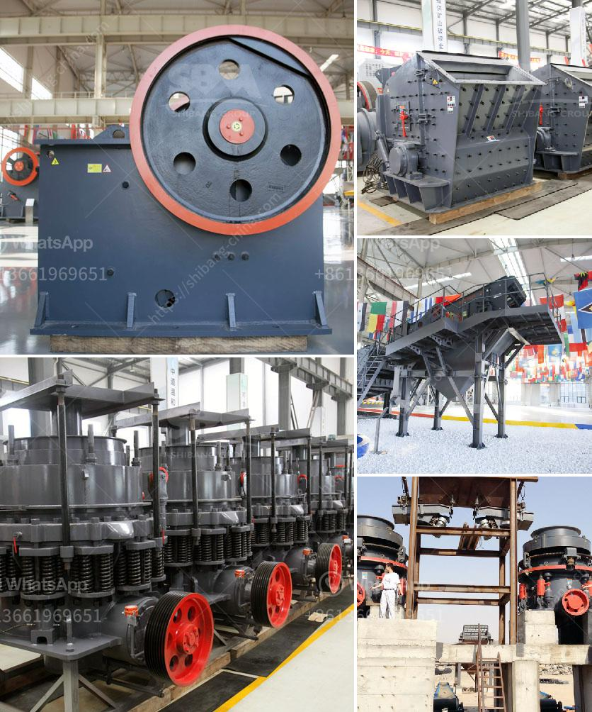

<h3>kaolin mining india</h3>
Kaolin, also known as China clay, is a white, soft, and plastic material that is derived from the mineral kaolinite. It is widely used in various industries such as ceramics, paper, rubber, and cosmetics. India is one of the largest producers of kaolin globally, and its mining industry plays a crucial role in the country's economy.

The kaolin mining industry in India began in the 1950s when the British Geological Survey discovered extensive deposits of kaolin in the Palnadu region of Andhra Pradesh. Since then, several mines have been established in various parts of the country, including Rajasthan, West Bengal, and Tamil Nadu.

India's kaolin deposits are generally classified as primary deposits, which means they are found close to the source rock. This results in higher purity and superior quality of kaolin. The primary kaolin deposits in India are mainly located in weathered pegmatite veins, granite gneiss, and hydrothermal veins.

The mining process of kaolin in India involves the use of various techniques such as open-pit mining, strip mining, and underground mining. After extraction, the crude kaolin undergoes processing to remove impurities and enhance its quality. This includes processes like bleaching, magnetic separation, and chemical treatment.

Kaolin mining in India has contributed significantly to the country's export earnings. The high-quality kaolin produced is in great demand, both domestically and internationally. It is primarily exported to countries like China, Japan, Thailand, Germany, and the United States. The versatile nature of kaolin allows it to be used in a wide range of applications, ensuring a stable market demand.

The mining industry has also provided employment opportunities to many local communities, contributing to their socio-economic development. However, there have been concerns raised about the environmental impact of kaolin mining. The extraction process can result in deforestation, soil erosion, and disruption of local ecosystems. Measures are being taken by the government and mining companies to mitigate these issues through sustainable mining practices.

India's kaolin mining industry continues to thrive, driven by both domestic consumption and export demand. With the government's focus on promoting the mining sector and the growing demand for kaolin in various industries, the future of kaolin mining in India looks promising. However, it is crucial to strike a balance between economic growth and environmental sustainability to ensure the long-term viability of the industry.
<h3>Contact us</h3><ul><li><strong>Whatsapp:&nbsp;<a href="https://wa.me/8613661969651">+8613661969651</a></strong></li><li><a href="https://swt.shibang-china.com/?git&amp;zhl&amp;kaolin mining india"><strong>Online Service(chat now)</strong></a></li></ul><h3>Related</h3><ul><li><a href='iron ore vibrator screen.md'>iron ore vibrator screen</a></li><li><a href='sand washing plant 50 ton day.md'>sand washing plant 50 ton day</a></li><li><a href='mining processing machine prices.md'>mining processing machine prices</a></li><li><a href='process of setting of a stone crusher in orissa.md'>process of setting of a stone crusher in orissa</a></li><li><a href='rock crushing and ballast.md'>rock crushing and ballast</a></li></ul>