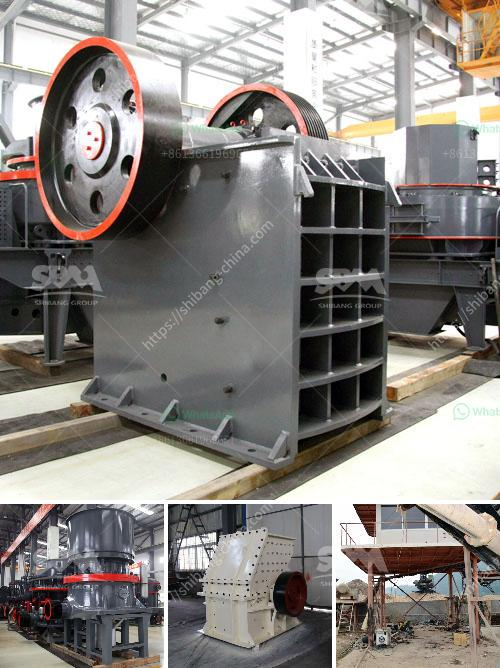

<h3>kaolin processing machinery</h3>
Kaolin, also known as China clay, is a versatile industrial mineral widely used in the ceramic, paper, rubber, and paint industries. It is mainly composed of the mineral kaolinite, a hydrous aluminum silicate. Kaolin has been mined for centuries and is one of the oldest industrial minerals. The mining and processing of kaolin involve large-scale operations and state-of-the-art machinery to meet the ever-increasing demand for kaolin products.

Kaolin is a unique industrial mineral that has properties that make it highly desirable for many industrial applications. These include its fine particle size distribution, high brightness, whiteness, and opacity, as well as its exceptional chemical and physical stability. To meet the specific requirements of different industries, kaolin undergoes a series of processing steps to achieve the desired characteristics.

The first step in kaolin processing is the excavation of raw ore from underground mines or from open-pit quarries. This process involves removing overburden (soil and rock) layers, exposing the mineral ore underneath. Once the ore is excavated, it is transported to a processing plant where it is crushed, dried, and pulverized to remove impurities such as quartz, feldspar, and iron oxide minerals. The resulting kaolin slurry is then processed through a series of mechanical and chemical steps to achieve the desired properties.

One of the critical pieces of equipment used in the kaolin processing is the dryer. It is a thermal processing device that removes moisture from the kaolin, resulting in an end product with optimal moisture content. The quality and efficiency of the dryer are crucial in achieving the desired characteristics of the kaolin product. Advanced dryers incorporate innovative features such as direct and indirect heating methods, multi-stage drying, and sophisticated control systems to ensure the precise moisture control required.

Another essential piece of machinery used in kaolin processing is the separator, a high-gradient magnetic separator (HGMS). It is used to remove iron and titanium impurities from processed kaolin, ensuring a high-quality and pure final product. The separator utilizes a magnetic field generated by a superconducting magnet to separate the magnetic impurities from the non-magnetic kaolin particles. The use of HGMS not only improves the purity of kaolin but also enhances its brightness, whiteness, and other physical and chemical properties.

In addition to dryers and separators, other machinery such as mills, hydrocyclones, and flotation cells are also used in kaolin processing. These equipment work together in a coordinated and integrated manner to ensure the overall efficiency and quality of the kaolin production process. The selection and design of these machines are critical to achieving the desired outcome and maximizing the profitability of the operation.

Kaolin processing machinery embodies the latest advancements in technology and innovation, allowing manufacturers to produce premium quality kaolin products in an environmentally sustainable manner. This machinery helps in reducing energy consumption, minimizing waste generation, and maximizing resource utilization. As the demand for kaolin continues to grow, the industry will rely on advanced processing machinery to meet the ever-increasing requirements and remain competitive in the global market.

In conclusion, kaolin processing machinery plays a vital role in the industrial production of high-quality kaolin products. From the extraction of raw ore to the final processing steps, advanced equipment ensures the efficient and cost-effective beneficiation of kaolin, resulting in products that satisfy the specific demands of various industries. With ongoing technological advancements, the kaolin processing machinery industry continues to evolve, paving the way for improved efficiency, sustainability, and profitability.
<h3>Contact us</h3><ul><li><strong>Whatsapp:&nbsp;<a href="https://wa.me/8613661969651">+8613661969651</a></strong></li><li><a href="https://swt.shibang-china.com/?git&amp;zhl&amp;kaolin processing machinery"><strong>Online Service(chat now)</strong></a></li></ul><h3>Related</h3><ul><li><a href='pe 600 900 primary jaw crusher.md'>pe 600 900 primary jaw crusher</a></li><li><a href='stone crusher dubai for sale.md'>stone crusher dubai for sale</a></li><li><a href='roller crusher for sale gumtree.md'>roller crusher for sale gumtree</a></li><li><a href='basalt crushing line.md'>basalt crushing line</a></li><li><a href='hot used trommel screen machine in sand.md'>hot used trommel screen machine in sand</a></li></ul>