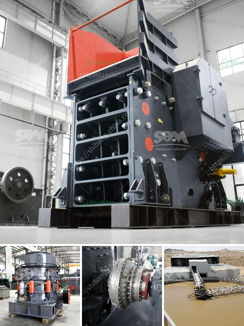

<h3>kenya jaw crusher for sale</h3>
The demand for jaw crushers is increasing steadily, with the rapid infrastructure development in Kenya. As a leading mining machinery manufacturer, we are committed to providing high-quality crusher machines to our customers. Our jaw crushers are known for their reliable performance and low maintenance.

One of the main advantages of our jaw crushers is their versatility. They can be used for various applications, including quarrying, mining, construction, and recycling. The jaw crushers are designed to crush large rocks into smaller pieces to facilitate transportation and processing. They have a simple structure with a fixed jaw plate and a moving jaw plate. The crushing chamber is deep and symmetrical, which enables efficient and consistent crushing.

Another key feature of our jaw crushers is the hydraulically adjustable CSS (Closed Side Setting). This allows the user to control the size of the product. Whether you need fine or coarse aggregates, our jaw crushers can be adjusted to meet your specific requirements.

In addition to the technical features, our jaw crushers are also known for their durability and reliability. They are built to withstand the toughest conditions in the field. With proper maintenance and regular servicing, our jaw crushers can last for many years, making them a cost-effective investment for any mining or construction operation.

Our jaw crushers for sale in Kenya are available in different sizes and capacities to meet the diverse needs of our customers. Whether you need a small jaw crusher for a small construction project or a large jaw crusher for a mining operation, we have the perfect solution for you.

If you are looking for a reliable and efficient jaw crusher for sale in Kenya, look no further. Contact us today to discuss your specific requirements and get a quote. We are confident that our jaw crushers will exceed your expectations and provide excellent performance in any application.
<h3>Contact us</h3><ul><li><strong>Whatsapp:&nbsp;<a href="https://wa.me/8613661969651">+8613661969651</a></strong></li><li><a href="https://swt.shibang-china.com/?git&amp;zhl&amp;kenya jaw crusher for sale"><strong>Online Service(chat now)</strong></a></li></ul><h3>Related</h3><ul><li><a href='stone crusher capsule.md'>stone crusher capsule</a></li><li><a href='manufacturing artificial sand in malaysia.md'>manufacturing artificial sand in malaysia</a></li><li><a href='jaw crusher 24x12 price.md'>jaw crusher 24x12 price</a></li><li><a href='grinding mill usa.md'>grinding mill usa</a></li><li><a href='belt conveyor untuk batubara.md'>belt conveyor untuk batubara</a></li></ul>