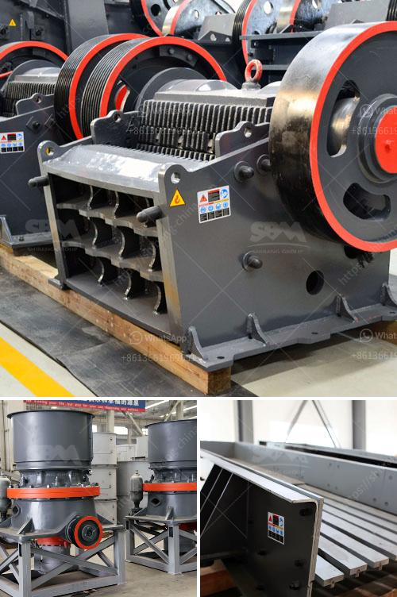

<h3>komatsu crusher for sale in malaysia</h3>
Komatsu is a well-known construction equipment company that is globally recognized for its reliable and high-performance machinery. One of their notable products is the Komatsu crusher, designed to break down various types of stones, rocks, and other demolition materials. If you happen to be in Malaysia and are in need of a crusher, Komatsu offers a range of options that can cater to your specific requirements.

The Komatsu crusher for sale in Malaysia provides immense versatility and is capable of crushing a wide range of materials in a short amount of time. Some of the materials that can be crushed by this machine include soil, coal, gravel, concrete, rocks, and even asphalt.

One of the key features of the Komatsu crusher is its ability to handle high volumes of material efficiently. Whether you are working on a large-scale construction project or a small home improvement task, this machine can easily handle the workload. It is designed with durability in mind, ensuring that it can withstand even the harshest working conditions.

The Komatsu crusher for sale in Malaysia also offers a high level of safety. It is equipped with various safety features, such as emergency stop buttons and automatic shut-off systems, to prevent accidents and protect the operator. Additionally, the machine is built with a sturdy frame and reinforced components to ensure stability during operation.

Another advantage of the Komatsu crusher is its compact size. Despite being a powerful and efficient machine, it is relatively compact and can be easily transported from one site to another. This makes it ideal for contractors and construction companies that need to move their equipment frequently.

In terms of maintenance, the Komatsu crusher is designed for easy upkeep. It comes with user-friendly controls and clear instructions, allowing operators to perform routine maintenance tasks without any hassle. Additionally, Komatsu provides excellent after-sales support, including spare parts availability and technical assistance, ensuring that your crusher remains in top condition.

When considering purchasing a crusher, it is crucial to evaluate the overall cost. The Komatsu crusher for sale in Malaysia offers a cost-effective solution for your crushing needs. Its high productivity and efficiency can help reduce labor costs while increasing productivity. Additionally, it requires minimal fuel consumption, making it an eco-friendly option.

In conclusion, the Komatsu crusher for sale in Malaysia presents a reliable, efficient, and cost-effective solution for various crushing applications. Whether you are a contractor working on a large-scale project or a homeowner undertaking a DIY project, this machine can handle your needs. Its versatility, safety features, and compact size make it a valuable tool to have in any construction site. With Komatsu's reputation for quality and excellent after-sales support, investing in their crusher is an investment in long-term efficiency and productivity.
<h3>Contact us</h3><ul><li><strong>Whatsapp:&nbsp;<a href="https://wa.me/8613661969651">+8613661969651</a></strong></li><li><a href="https://swt.shibang-china.com/?git&amp;zhl&amp;komatsu crusher for sale in malaysia"><strong>Online Service(chat now)</strong></a></li></ul><h3>Related</h3><ul><li><a href='mobile stone crusher with vibrating screen.md'>mobile stone crusher with vibrating screen</a></li><li><a href='calcium carbonate manufacturing plant.md'>calcium carbonate manufacturing plant</a></li><li><a href='china raymond mill company.md'>china raymond mill company</a></li><li><a href='china grove roller mill.md'>china grove roller mill</a></li><li><a href='ball mill mexico.md'>ball mill mexico</a></li></ul>