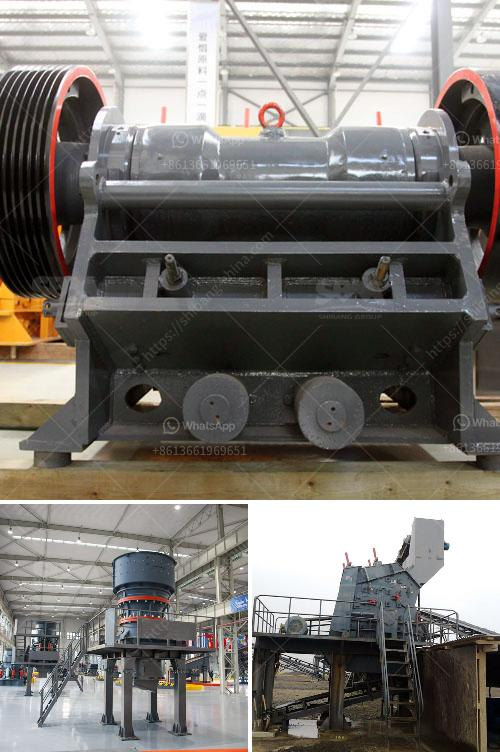

<h3>laboratory grinding mills jaw crushers</h3>
Laboratory grinding mills and jaw crushers are essential tools for conducting research and analysis in the laboratory. These instruments are used for particle size reduction, grinding, and crushing of various materials to obtain the desired composition and quality.

Laboratory grinding mills, such as ball mills and rod mills, are commonly used in laboratories to reduce the size of ore samples for further processing. These mills use both impact and friction forces to grind the ore, releasing valuable minerals from the gangue material. By carefully controlling the grinding process, researchers can obtain accurate and reproducible results, which are crucial for the evaluation of ore samples.

Jaw crushers, on the other hand, are used to crush materials for further processing or analysis. These crushers consist of a fixed jaw and a moving jaw, where the material is crushed by the continuous compression and shearing action between these two surfaces. Jaw crushers are commonly used for reducing the size of rock samples or drill cores before sieving or further analysis.

Both laboratory grinding mills and jaw crushers are equipped with safety features to prevent accidents and ensure user protection. These include safety guards, emergency stop buttons, and interlock systems that prevent operation when certain conditions are not met.

In addition to ore processing, laboratory grinding mills and jaw crushers are also used in a variety of other applications. For example, they are widely used in the pharmaceutical industry for grinding and crushing of medicinal materials. They are also used in the chemical industry for grinding and blending of various compounds.

In conclusion, laboratory grinding mills and jaw crushers are indispensable tools in the laboratory for particle size reduction, grinding, and crushing of various materials. They are essential for obtaining accurate and reproducible results in research and analysis. Whether it is ore processing, pharmaceutical preparation, or chemical blending, these instruments play a vital role in advancing scientific knowledge and innovation.
<h3>Contact us</h3><ul><li><strong>Whatsapp:&nbsp;<a href="https://wa.me/8613661969651">+8613661969651</a></strong></li><li><a href="https://swt.shibang-china.com/?git&amp;zhl&amp;laboratory grinding mills jaw crushers"><strong>Online Service(chat now)</strong></a></li></ul><h3>Related</h3><ul><li><a href='portable crushing and screening.md'>portable crushing and screening</a></li><li><a href='stone crushers hydraulic.md'>stone crushers hydraulic</a></li><li><a href='granite and basalt crushing line ton per day.md'>granite and basalt crushing line ton per day</a></li><li><a href='distributor stone crusher di indonesia.md'>distributor stone crusher di indonesia</a></li><li><a href='chrome mining methods in zimbabwe.md'>chrome mining methods in zimbabwe</a></li></ul>