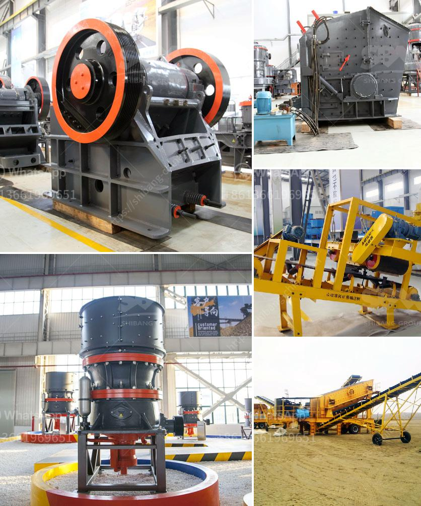

<h3>large capacity jaw crusher stone crusher quarry machine</h3>
In recent years, there has been an increasing demand for stone crushers and quarry machines due to the rapid development of the mining industry. The large capacity jaw crusher, also called stone crusher, is suitable for crushing various kinds of materials such as limestone, granite, quartz stone, river pebble, iron ore, copper ore, etc.

Due to the increasing market demand for stone crushers, more and more manufacturers are launching large capacity jaw crushers to meet the market demand. The large capacity jaw crusher is mainly used for primary crushing of various kinds of stones and bulk materials. It is widely used in mining, smelting, building materials, highway, railway, water conservancy and chemical industries.

Compared with the traditional jaw crusher, the large capacity jaw crusher has significant improvements in performance. It adopts a V-shaped crushing cavity design, which makes the feeding port larger, thus increasing the feeding capacity. The machine has a deep crushing chamber and no dead zone, which improves the feeding and crushing efficiency. The large capacity jaw crusher also has a long crushing chamber and a wide range of applications. It can crush various materials with a compressive strength of not more than 320 MPa.

The large capacity jaw crusher is equipped with a double wedge adjustment device, which is simpler, safer and faster than the old gasket adjustment method. It saves time and effort and can easily adjust the discharge opening to meet different production needs. In addition, the large capacity jaw crusher is equipped with a hydraulic cylinder, which can quickly and conveniently adjust the size of the discharge port, saving downtime and improving production efficiency.

The large capacity jaw crusher has stable performance, low operating cost, simple structure, easy operation and maintenance, energy-saving and high efficiency. It is widely used in various industries, such as mining, metallurgy, building materials, highways, railways, water conservancy and chemical industries.

When purchasing a large capacity jaw crusher, users should pay attention to the following points: Firstly, choose a reliable manufacturer with strong technical strength and good reputation. Only by selecting a high-quality manufacturer can users ensure the quality and performance of the equipment. Secondly, users should consider their own production needs and select a suitable model according to the size and hardness of the materials to be crushed. Finally, users should pay attention to the after-sales service of the manufacturer. A comprehensive after-sales service system can provide users with timely and effective technical support and better protect their legitimate rights and interests.

To sum up, the large capacity jaw crusher is an ideal equipment for crushing various hard and abrasive materials. It has a wide range of applications and can meet the crushing needs of different industries. With its excellent performance and reliable quality, it has become a popular choice for users in the mining industry. By choosing a reputable manufacturer and considering their own production needs, users can find a suitable large capacity jaw crusher to improve their production efficiency and create greater value.
<h3>Contact us</h3><ul><li><strong>Whatsapp:&nbsp;<a href="https://wa.me/8613661969651">+8613661969651</a></strong></li><li><a href="https://swt.shibang-china.com/?git&amp;zhl&amp;large capacity jaw crusher stone crusher quarry machine"><strong>Online Service(chat now)</strong></a></li></ul><h3>Related</h3><ul><li><a href='granite crushing plant for sale in south africa.md'>granite crushing plant for sale in south africa</a></li><li><a href='laboratory grinding mills jaw crushers.md'>laboratory grinding mills jaw crushers</a></li><li><a href='jaw crusher manufacturer germany.md'>jaw crusher manufacturer germany</a></li><li><a href='mineral grinding mill machine used for sale uk.md'>mineral grinding mill machine used for sale uk</a></li><li><a href='dicalcium phosphate process hydrochloric acid flow chart.md'>dicalcium phosphate process hydrochloric acid flow chart</a></li></ul>