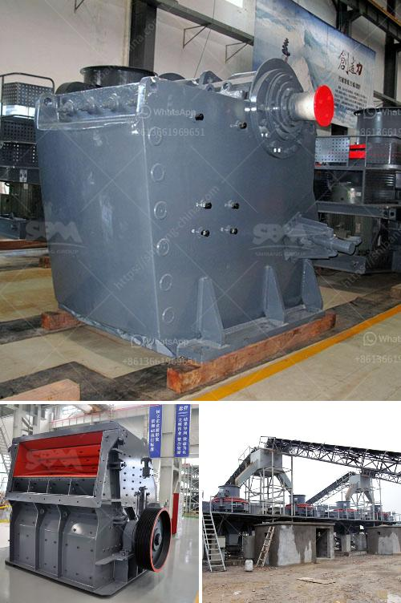

<h3>large quarry machine manufacturers</h3>
The mining industry is one of the most crucial sectors that contribute significantly to a nation's economic growth. Quarrying, a specific subset of mining, involves extracting solid minerals and other materials from deep within the Earth's surface. The process requires heavy-duty machines that can withstand the rigorous demands of quarrying operations. This is where large quarry machine manufacturers play a pivotal role, supplying the industry with powerful equipment to meet its needs.

Large quarry machine manufacturers are renowned for their expertise in designing and manufacturing heavy-duty mining machinery. Their commitment to innovation and technology has revolutionized the quarrying process, increasing efficiency and productivity. These manufacturers have developed robust machines that can withstand harsh conditions, making them essential for successful quarrying operations.

One of the main advantages of large quarry machine manufacturers is their ability to produce equipment on a massive scale. Due to their extensive manufacturing facilities, they can meet the high demand for quarry machinery worldwide. This allows companies in the mining sector to acquire the necessary equipment promptly, ensuring uninterrupted operations and maximizing production.

Moreover, large quarry machine manufacturers prioritize safety standards in their designs. Quarrying can be a dangerous occupation, involving heavy machinery and potential hazards. These manufacturers create machines with advanced safety features, mitigating risks and protecting the operators and workers involved in the quarrying process.

In addition to manufacturing machinery, large quarry machine manufacturers also provide comprehensive aftersales service and support. This includes maintenance, repair, and replacement of parts, ensuring the longevity and reliability of the equipment. Their commitment to customer satisfaction sets them apart and contributes to continued partnerships with mining companies worldwide.

Overall, large quarry machine manufacturers play an integral role in the mining industry by supplying essential equipment. Their expertise, commitment to innovation, and dedication to safety make them leaders in the field. With their continuous efforts to improve efficiency and productivity, these manufacturers facilitate the growth and development of quarrying operations worldwide.
<h3>Contact us</h3><ul><li><strong>Whatsapp:&nbsp;<a href="https://wa.me/8613661969651">+8613661969651</a></strong></li><li><a href="https://swt.shibang-china.com/?git&amp;zhl&amp;large quarry machine manufacturers"><strong>Online Service(chat now)</strong></a></li></ul><h3>Related</h3><ul><li><a href='catalog of vertical grinding mill pdf.md'>catalog of vertical grinding mill pdf</a></li><li><a href='list of machinery in gypsum crushing and limestone.md'>list of machinery in gypsum crushing and limestone</a></li><li><a href='stone crusher prices.md'>stone crusher prices</a></li><li><a href='small stone crusher machine in italy.md'>small stone crusher machine in italy</a></li><li><a href='gypsum crusher manufacturing plant.md'>gypsum crusher manufacturing plant</a></li></ul>