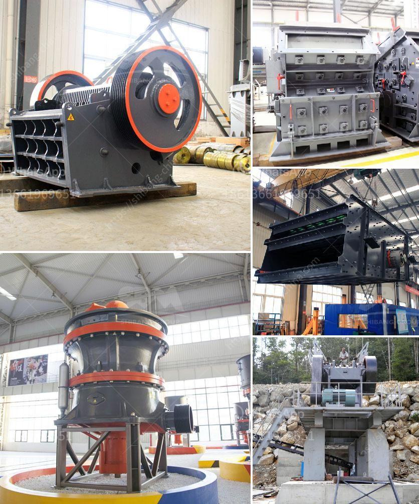

<h3>latest stone crusher east timor</h3>
The latest stone crusher in East Timor has undergone several innovations, and it is now more efficient and powerful than ever. The East Timor government has seen great value in investing in this industry, as it has created job opportunities and stimulated economic growth in the country.

The stone crusher is designed with advanced technology and hydraulic system. The machine features a heavy-duty design and a powerful motor, making it suitable for demanding mining operations. It is capable of crushing various types of stones, such as limestone, granite, basalt, river pebble, and more.

One of the notable features of this stone crusher is its adjustable output size. Users can easily adjust the output size according to their specific needs, whether it is for construction purposes, road building, or landscaping. This flexibility allows for more versatile applications and maximizes the productivity of the machine.

Furthermore, the stone crusher in East Timor is equipped with multiple safety features. It has a remote control system that allows operators to control the machine from a safe distance, minimizing the risk of accidents. Additionally, it is designed with a strong protective shield to ensure the safety of workers during operation.

The stone crusher in East Timor has garnered positive feedback from customers who have used it. They praise its reliability, durability, and low maintenance requirements. The machine has proven to be highly efficient in crushing materials, reducing the need for manual labor and increasing productivity.

Moreover, the stone crusher is environmentally friendly. It is designed to minimize dust and noise emissions, ensuring a sustainable and responsible operation. The machine's efficient crushing process also reduces waste, as it can recycle and reuse crushed materials for other applications.

In conclusion, the latest stone crusher in East Timor is a powerful and versatile machine that has undergone several enhancements. Its advanced technology, adjustable output size, and safety features make it suitable for a variety of applications. The machine's efficiency and environmental friendliness contribute to the overall growth of East Timor's economy.
<h3>Contact us</h3><ul><li><strong>Whatsapp:&nbsp;<a href="https://wa.me/8613661969651">+8613661969651</a></strong></li><li><a href="https://swt.shibang-china.com/?git&amp;zhl&amp;latest stone crusher east timor"><strong>Online Service(chat now)</strong></a></li></ul><h3>Related</h3><ul><li><a href='crusher plant price pakistan.md'>crusher plant price pakistan</a></li><li><a href='differences between hammer mill and ball mill.md'>differences between hammer mill and ball mill</a></li><li><a href='used mine equipment price.md'>used mine equipment price</a></li><li><a href='quartz silica pulverizer machine.md'>quartz silica pulverizer machine</a></li><li><a href='price of grinding machine for europe.md'>price of grinding machine for europe</a></li></ul>