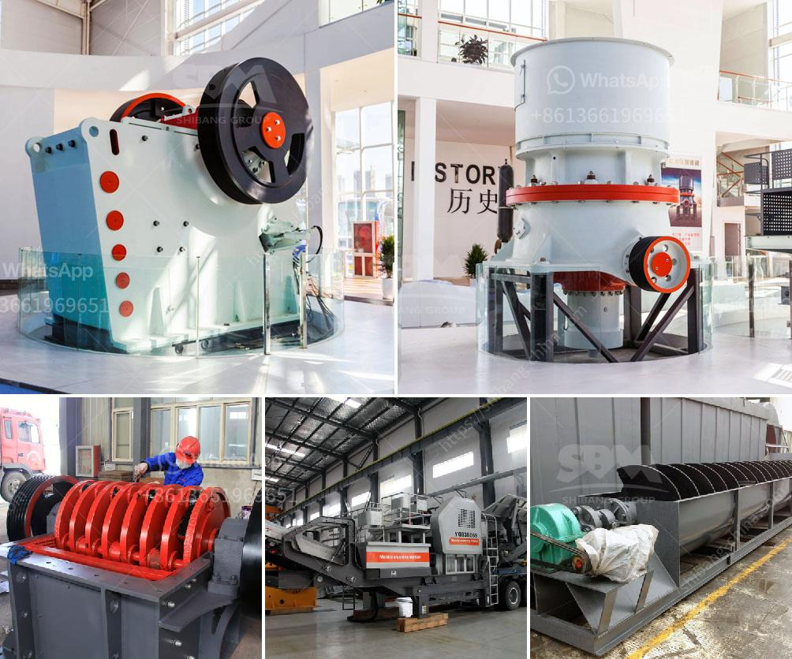

<h3>latest three roll mills</h3>
Three roll mills are widely considered to be one of the most effective tools in the industrial sector for refining and processing materials. These machines are essential for various industries including pharmaceutical, cosmetic, and chemical manufacturing. In recent years, technological advancements have led to the development of some impressive three roll mills that offer improved performance and enhanced capabilities.

The first of these latest three roll mills is designed with a focus on precision and efficiency. It boasts a robust structure and advanced control systems that allow for smooth and accurate processing of materials. With precise temperature and speed control, this mill ensures optimal product quality and consistency. Additionally, its user-friendly interface makes operation hassle-free, even for operators with minimal expertise.

The second addition to the latest three roll mills is equipped with innovative features that enhance safety and productivity. This mill is built with an enhanced cooling system that efficiently dissipates heat generated during the processing. With better control over temperature, there is a reduced risk of material degradation and improved efficiency. Furthermore, this mill is equipped with safety measures such as emergency stop buttons and advanced interlocking systems, ensuring the well-being of operators.

Lastly, the third three roll mill in this lineup is designed with versatility in mind. It offers a wide range of customizable options to cater to different material requirements. Whether it is a high viscosity substance or a delicate formulation, this mill can be adjusted to achieve the desired results. Its ability to handle various materials and meet different process demands makes it an ideal choice for industries with diverse manufacturing needs.

In conclusion, the latest three roll mills have brought significant advancements to the industrial sector. With their improved capabilities, these mills offer enhanced precision, safety, and versatility. As technology continues to evolve, it is likely that we will witness further advancements in three roll mills, making them essential tools for various industries for years to come.
<h3>Contact us</h3><ul><li><strong>Whatsapp:&nbsp;<a href="https://wa.me/8613661969651">+8613661969651</a></strong></li><li><a href="https://swt.shibang-china.com/?git&amp;zhl&amp;latest three roll mills"><strong>Online Service(chat now)</strong></a></li></ul><h3>Related</h3><ul><li><a href='aggregate equipment for sale.md'>aggregate equipment for sale</a></li><li><a href='silica sand production using ball mill in dubai.md'>silica sand production using ball mill in dubai</a></li><li><a href='start up granite quarry business.md'>start up granite quarry business</a></li><li><a href='equipment equipment for mineral crushing.md'>equipment equipment for mineral crushing</a></li><li><a href='indopol roller grinding mills.md'>indopol roller grinding mills</a></li></ul>