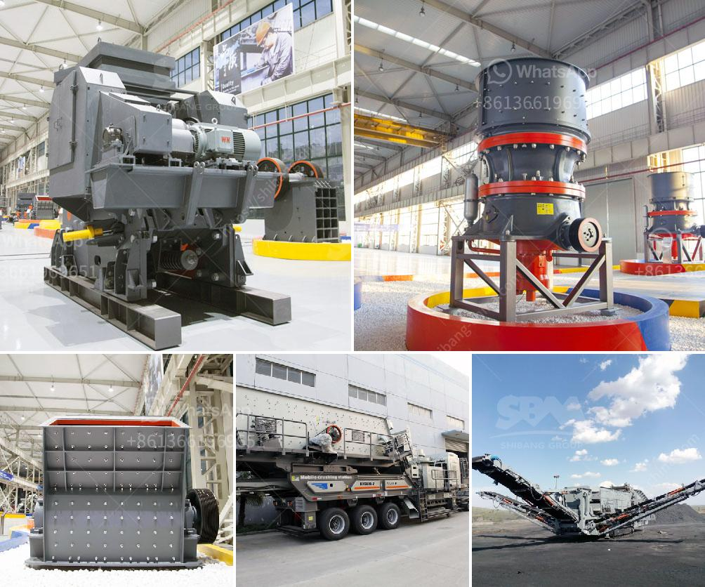

<h3>lime and dolomite crusher plant</h3>
Lime and dolomite crusher plant are incredibly popular in the cement industry and their applications include aggregate and gravel production, soil stabilization and in making glass. It is mainly used for breaking large stones into small pieces and producing certain shapes and sizes of sand and gravel. There are various types of crusher machines such as jaw crusher, counterattack crusher, vertical impact crusher, hydraulic cone crusher, hammer crusher, roll crusher, compound crusher, cone crusher, the two-stage crusher, gyratory crusher, mobile crusher and so on. All these types of crusher machines have different crushing principles, and crushing effects, and there are many factors that influence their production capacity. So, in this article, we will analyze the main factors affecting the crushing capacity of lime and dolomite crusher plants.

1. Feeding size: The size of the raw materials will directly affect the size of the discharge materials after crushing. Generally, the larger the size of the feeding materials, the higher the productivity of the crusher plants. However, it is not recommendable to crush materials that are too large because it may cause a waste of resources and affect the overall efficiency.

2. Crushing ratio: The crushing ratio is an important evaluation index for measuring the performance of lime and dolomite crusher plants. It indicates the degree of reduction of raw materials after crushing. The larger the crushing ratio, the better the crushing effect, and the higher the productivity. The crushing ratio is inversely proportional to the size of the discharge materials.

3. Productivity: Productivity means the production volume of lime and dolomite crusher plants. It mainly depends on the equipment model, specifications, power, and raw materials. The higher the productivity, the greater the output per unit time and the more economical the overall production process.

4. Equipment performance: The performance of each equipment in lime and dolomite crusher plants usually includes feeding, crushing, conveying, screening, and washing. Each equipment operates independently, but the performance of one equipment will affect the performance of the entire line. Therefore, it is necessary to ensure that all the equipment in the crushing plant are technically synchronized.

5. The variation of materials: When the hardness of raw materials is relatively large, it may cause the wear of crushing equipment more seriously, thus affecting the crushing capacity. For materials with a higher viscosity, it is also necessary to consider their impact on the operation of equipment.

In conclusion, lime and dolomite crusher plants are important equipment for mining and processing various construction materials. They have wide applications in the industry of building materials, metallurgy, chemical engineering, mining, refractory, ceramics, cement, etc. The processes of lime and dolomite crusher plants involved are equally important. They include primary crushing, secondary crushing and tertiary crushing, and screening. The crushing process is mainly carried out by a variety of crushers. Different crushers have different crushing principles and crushing effects. The choice of crusher will depend on the properties of raw materials, production capacity, energy consumption, and other factors. Therefore, it is important to understand the factors that influence the crushing capacity of lime and dolomite crusher plants. By doing so, the crusher can be operated at maximum productivity, reducing the downtime and avoiding unnecessary costs.
<h3>Contact us</h3><ul><li><strong>Whatsapp:&nbsp;<a href="https://wa.me/8613661969651">+8613661969651</a></strong></li><li><a href="https://swt.shibang-china.com/?git&amp;zhl&amp;lime and dolomite crusher plant"><strong>Online Service(chat now)</strong></a></li></ul><h3>Related</h3><ul><li><a href='concrete crushing machine price in china.md'>concrete crushing machine price in china</a></li><li><a href='gypsum production line for making.md'>gypsum production line for making</a></li><li><a href='grinding mill for quartz in to 500 mesh in india.md'>grinding mill for quartz in to 500 mesh in india</a></li><li><a href='turkey stone crushers.md'>turkey stone crushers</a></li><li><a href='manufacturer of rotary screen for crushed lime stone.md'>manufacturer of rotary screen for crushed lime stone</a></li></ul>