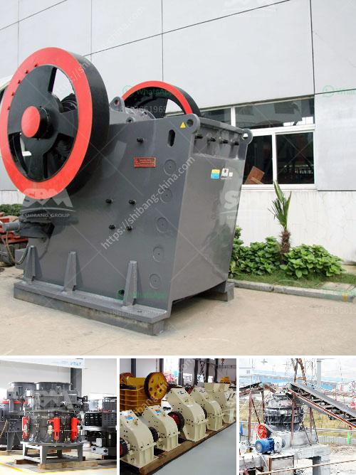

<h3>lime mining crusher in india</h3>
Lime, also known as calcium oxide, is a key ingredient in many industries such as agriculture, building construction, and chemical manufacturing. Lime is used as a soil amendment, in the production of cement, and in various chemical processes. It is obtained by mining limestone, a sedimentary rock that is mainly composed of calcium carbonate.

In India, limestone mining is carried out by various methods depending upon the location and quality of the deposits. The size, contour, depth, and grade of the deposit determine the mining technique to be used. Oftentimes, mining operations involve the use of drilling and blasting techniques to extract the limestone from the earth.

Once the ore is extracted, it is transported to a crusher plant for crushing and screening. The common type of crushers used in lime mining operations are jaw crushers, impact crushers, and hammer crushers. Jaw crushers are often used for primary crushing and are perhaps the most popular crusher worldwide. These compressive crushers reduce the size of the ore by squeezing it between two jaws, one stationary and one movable.

Impact crushers, on the other hand, use the principle of rapid impact to crush the material. They contain hammers mounted on a spinning rotor that strike the incoming ore, breaking it apart. Hammer crushers, similar to impact crushers, utilize rotating hammers to pulverize the material. These crushers are particularly suitable for limestone with low abrasiveness and high moisture content.

In India, several companies specialize in the production of lime crushers. They manufacture and supply crushers that are suitable for mining operations, ensuring high productivity, durability, and ease of maintenance. These crushers are designed to handle the harsh conditions typically encountered in lime mining operations, such as dust, heat, and moisture.

Lime mining plays a vital role in India's industrial growth and development. The availability of high-quality lime is essential for various sectors, and the efficient crushing of limestone ore is crucial for maintaining a steady supply. With the advancements in crusher technology, mining companies in India can now benefit from improved efficiency and reduced downtime, resulting in increased production and profitability.
<h3>Contact us</h3><ul><li><strong>Whatsapp:&nbsp;<a href="https://wa.me/8613661969651">+8613661969651</a></strong></li><li><a href="https://swt.shibang-china.com/?git&amp;zhl&amp;lime mining crusher in india"><strong>Online Service(chat now)</strong></a></li></ul><h3>Related</h3><ul><li><a href='how to calculate the operating cost of a stone crusher.md'>how to calculate the operating cost of a stone crusher</a></li><li><a href='gypsum powder production line germany.md'>gypsum powder production line germany</a></li><li><a href='mobile crushers stone in south africa.md'>mobile crushers stone in south africa</a></li><li><a href='spare parts rollers xzm ultrafine mill.md'>spare parts rollers xzm ultrafine mill</a></li><li><a href='materials for zenith jaw crusher in europe.md'>materials for zenith jaw crusher in europe</a></li></ul>