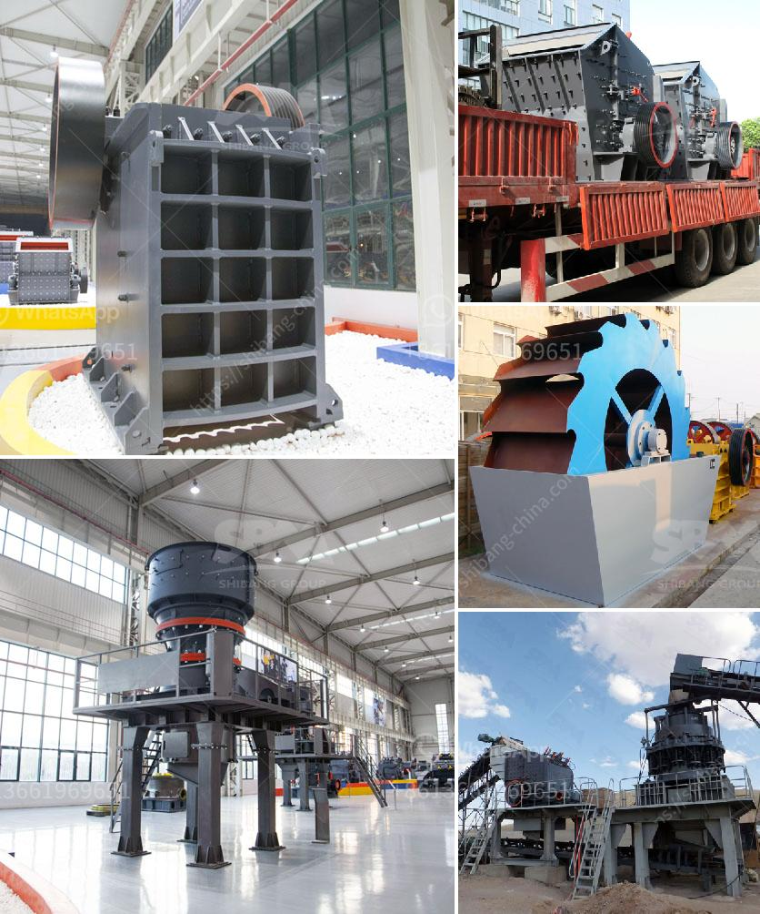

<h3>lime powder making machine</h3>
Lime powder is widely used in various industries such as construction, agriculture, and chemical. Lime powder making machine, also known as lime powder mill, is a kind of industrial grinding machines used for grinding limestone into powder. It is also called limestone grinding mill or limestone mill.

With the booming development of construction industry, it demands more and more limestone for construction purposes. Therefore, an increasing number of manufacturers are seeking to develop new types of lime powder making machines to meet the market demand.

The lime powder making machine consists of primary crusher, bucket elevator, storage bin, vibrating feeder, micro-grinding main machine, frequency conversion classifier, double cyclone dust collector, pulse dust removal system and other components.

The working principle of lime powder making machine is as follows: after large pieces of limestone are crushed by the jaw crusher or hammer crusher, they are sent to the storage bin by the bucket elevator, and then evenly and quantitatively transported to the grinding chamber of the main machine for grinding by the vibrating feeder.

The crushed materials are graded by an airflow classifier, and the qualified powder enters the cyclone dust collector through the pipeline. The fine powder is collected by the pulse dust collector, and the unqualified powder is returned to the grinding chamber for re-grinding until it meets the required particle size.

The lime powder making machine has many advantages. Firstly, it has high grinding efficiency, low power consumption, and low operating cost. Secondly, it has centralized control system, so the automatic control saves labor costs. Thirdly, the finished product has high whiteness and purity, and the particle size is even and adjustable.

Moreover, the lime powder making machine has a compact structure, small footprint, and convenient installation and maintenance. It adopts advanced technology, and the wearing parts are made of high-quality wear-resistant materials, which greatly prolongs the service life of the equipment.

In addition, the lime powder making machine has a wide range of applications. It can grind various non-flammable and explosive materials with Mohs hardness below 9.3 and humidity below 7%, such as limestone, gypsum, calcite, barite, talc, dolomite, marble, and other materials.

To sum up, the lime powder making machine is an ideal equipment for grinding limestone into powder. It greatly improves the efficiency of lime powder production and saves labor costs. It is widely used in various industries and plays a significant role in industrial production. With the continuous expansion of the market demand for lime powder, the development and improvement of lime powder making machine will surely become an important trend in the future.
<h3>Contact us</h3><ul><li><strong>Whatsapp:&nbsp;<a href="https://wa.me/8613661969651">+8613661969651</a></strong></li><li><a href="https://swt.shibang-china.com/?git&amp;zhl&amp;lime powder making machine"><strong>Online Service(chat now)</strong></a></li></ul><h3>Related</h3><ul><li><a href='crushers discarded stone crusher.md'>crushers discarded stone crusher</a></li><li><a href='concrete waste crushing and iron.md'>concrete waste crushing and iron</a></li><li><a href='sand crusher cost.md'>sand crusher cost</a></li><li><a href='crushing rock aggregate machinery.md'>crushing rock aggregate machinery</a></li><li><a href='rock crushing and ballast.md'>rock crushing and ballast</a></li></ul>