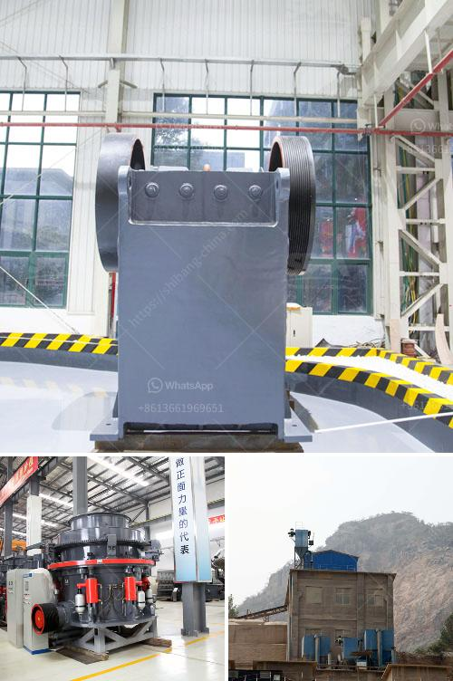

<h3>lime stone crusher section in cement plant pdf</h3>
Limestone is a sedimentary rock composed mainly of calcium carbonate (CaCO3), usually calcite. In the cement plant, limestone is the major raw material for cement production. Go through crushing, grinding process, and then make in the dust. Limestone comes in large pieces from the quarry to the factory and, therefore, must be crushed to reduce and homogenize the grain size.

To effect the grinding of the most important raw material for the process in terms of quantity, arose the following alternatives: Primary crushing of limestone. Jaw crusher for primary crushing limestone: jaw crusher is used as primary crushing equipment in the crushing plant of limestone. There are two types of jaw crusher: jaw crusher series PEW and PE series Jaw Crusher. Jaw crushers have different capacity and different fineness of the finished products. The common capacity is 50t / h, 100 t / h, 150 t / h 200 t / h, and 300 to 400 t / h. The usual fine is 20 to 50 mm.

Secondary crushing limestone. After primary crushing, use the impact crusher for secondary crushing. Impact Crusher is also the stone crushing machine used in common limestone quarry. It has the functions of grinding and training, can make very good cubic shape. Tertiary crushing limestone. Cone Crusher Grinding tertiary limestone: After the first other shredding available gyratory crusher cone but this time Simons system. Their choice is based primarily on the adaptation to a fineness greater, since there is present as large pieces of limestone are added also other advantages. If you need finer particles, one can choose the vertical roller crusher.

Limestone crusher used in cement plant for ecuador on sale Nowadays, we have established a friendly relationship with local quarry contractors in Ecuador and can provide you with comprehensive technical support. In the course of cement processing plant, limestone is the largest amount of raw materials for cement production, and then it is fed into the cement kilns for burning for its remarkable advantages, such as thermal expansion and mobility. Along with the quick-paced development of cement industry, the demand for limestone crusher will be further increased. DIY limestone crusher. Great Wall heavy industry is a world leading China limestone crusher manufacturer,which allows you to buy the most satisfied equipment. There are two main types of crushers made by Great Wall. These include the jaw crusher, a type of limestone crusher that can be mounted on a stationary structure and also available with other mobility, such as the wheel-mounted mobile crusher, and the second is the limestone crusher fitted with a powerful rotor that spins at high speed to crush the rocks which are placed into the frame of the crusher.

In cement plants, cement manufacturing needs to go through the following six processes: 1. Raw Materials Mining; 2. Raw Materials Crushing, Proportioning & Blending; 3. Raw Materials Grinding; 4. Coal Grinding & Pre-Blending; 5. Clinker Production; 6. Cement Grinding. These processes are explained in detail, and you can find the relevant information in the cement manufacturing section of our website. 

In conclusion, limestone crusher is a powerful machine that is used widely in the cement industry to crush stones and rock materials into smaller pieces. In addition, it is used to control the particle size of materials and minimize fine particles. Limestone Crusher clinkering agrees with the capacity, hardness and discharge sizes of general stones. Limestone crusher capacity is contingent upon table throughput, feed particle size, material friability, and material abrasiveness. 

Overall, it is safe to say that limestone crusher section in a cement plant plays a crucial role in the cement manufacturing process. Making use of the latest technologies, lime stone crushing reduces pollution and improves efficiency, while preserving natural resources.
<h3>Contact us</h3><ul><li><strong>Whatsapp:&nbsp;<a href="https://wa.me/8613661969651">+8613661969651</a></strong></li><li><a href="https://swt.shibang-china.com/?git&amp;zhl&amp;lime stone crusher section in cement plant pdf"><strong>Online Service(chat now)</strong></a></li></ul><h3>Related</h3><ul><li><a href='mobile rock crusher for sale.md'>mobile rock crusher for sale</a></li><li><a href='rencana bisnis perusahaan tambang pdf.md'>rencana bisnis perusahaan tambang pdf</a></li><li><a href='jaw crusher for sale in saudi.md'>jaw crusher for sale in saudi</a></li><li><a href='how to build a concrete crusher.md'>how to build a concrete crusher</a></li><li><a href='hammer mill price south africa.md'>hammer mill price south africa</a></li></ul>