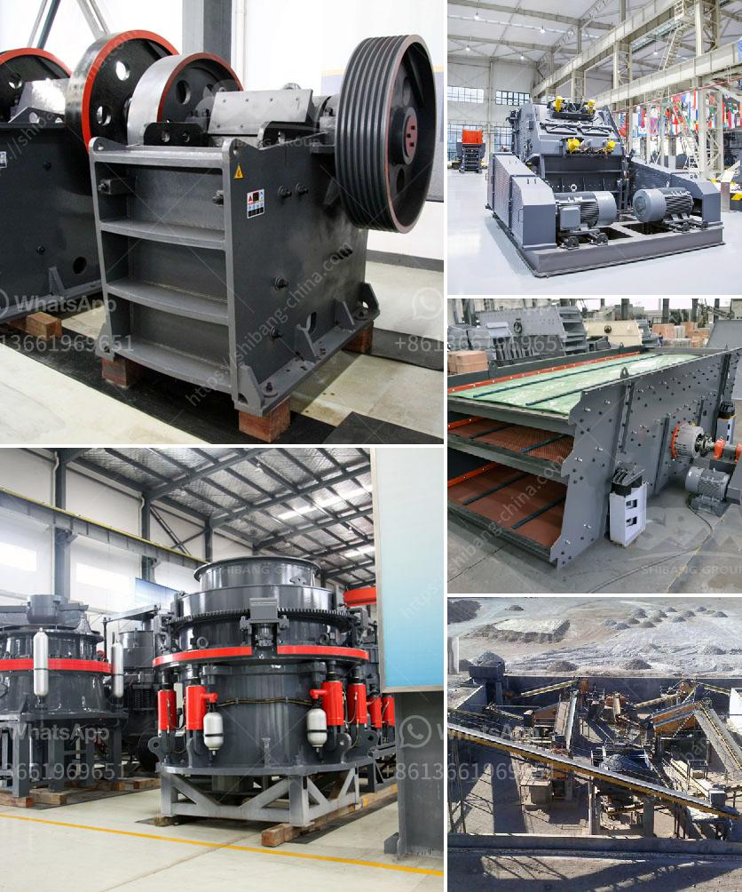

<h3>limestone crusher machine price</h3>
Limestone is a sedimentary rock composed largely of calcium carbonate (CaCO3). Limestone often contains variable amounts of silica or siliceous skeletal fragment, as well as varying amounts of clay, silt, and sand. Limestone rocks are used for a variety of purposes such as building materials, road construction, and agriculture. Limestone crushers machines are used in mining and smelting projects.

Limestone is widely distributed in nature and is an important raw material for many industries. Limestone can be used to make various items, including cement, building materials, and even toothpaste. With the continuous development of the construction industry, the demand for limestone has been rising, which also drives the demand for limestone crushers.

The limestone crusher machine is a device that crushes the limestone material with super-strong crushing force and superior performance, making it one of the preferred equipment in limestone crushing production line. Due to its extensive application range in various fields such as building materials, mining, and smelting industries, the limestone crusher has become a hot topic in the industry.

When selecting a limestone crusher machine, it is essential to consider the specific material characteristics and its downstream application. The crushing equipment that suits the specific needs of different users should be selected. Fote Machinery, as a manufacturer of crushers with 40 years of manufacturing experience, produces various types and models of crushers, including jaw crushers, impact crushers, cone crushers, and mobile crushers. Fote limestone crushers are designed for high-quality and high-efficiency crushing performance, featuring full adaptability and flexibility.

The limestone crusher machine is equipped with a variety of crusher accessories, including wear-resistant parts, feeders, vibrating screens, etc. The specifications of these parts differ, which makes it convenient for processing various materials. It is an ideal crushing equipment for primary crushing, secondary crushing, and fine crushing.

The limestone crusher machine is available with different crushing capacities, making it adaptable to different production needs. With the ability to process materials from 50-800t/h, the limestone crusher machine price is also different. Although the price is related to the performance and features of the equipment, many customers will consult the price when purchasing the equipment. To provide customers with a reference price, Fote Machinery will introduce the limestone crusher machine price for you.

Different models of limestone crushers have different investment costs. Limestone crusher machine price will vary greatly. So how much does it cost? Generally, jaw crushers are suitable for primary crushing, impact crushers are suitable for medium crushing, and cone crushers are suitable for fine crushing. The cost of limestone crusher is based on the specific parameters and market factors. As mentioned above, the limestone crusher machine is available in various types, including jaw crusher, cone crusher, and impact crusher. The cost of each type varies due to different specifications and models. Therefore, customers need to know the specific price comprehensively. 

In conclusion, the limestone crusher machine price is based on past historical data, comprehensive market analysis, and consideration of customer needs. Fote Machinery's crushers have reasonable price, reliable performance, and convenient operation, bringing high profits to users.
<h3>Contact us</h3><ul><li><strong>Whatsapp:&nbsp;<a href="https://wa.me/8613661969651">+8613661969651</a></strong></li><li><a href="https://swt.shibang-china.com/?git&amp;zhl&amp;limestone crusher machine price"><strong>Online Service(chat now)</strong></a></li></ul><h3>Related</h3><ul><li><a href='stone crusher seller.md'>stone crusher seller</a></li><li><a href='ball mill for sale south africa.md'>ball mill for sale south africa</a></li><li><a href='lime mining crusher in india.md'>lime mining crusher in india</a></li><li><a href='impact crushers manufacture.md'>impact crushers manufacture</a></li><li><a href='vertical roller mill in cement plant.md'>vertical roller mill in cement plant</a></li></ul>