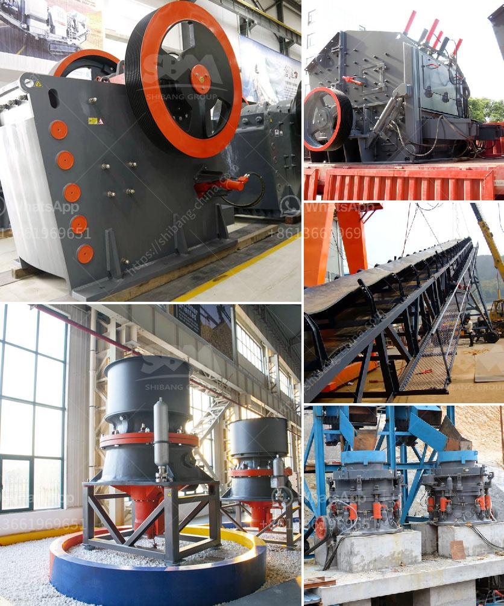

<h3>limestone crushing machines</h3>
Limestone crushing machines are widely used in the mining industry for crushing different types of rocks and ores into smaller pieces. Limestone is a sedimentary rock found in high abundance around the globe and it is known for its durability and strength. Limestone can be crushed into various sizes and used for different purposes, ranging from construction materials to agriculture.

Limestone crushing machines consist of jaw crusher, impact crusher, cone crusher, hammer crusher, and roller crusher. Depending on the characteristics of the limestone, hardness, and required output size of the finished product, they can be selected accordingly. Each type of machine has its unique advantages and can effectively crush limestone into the desired sizes.

Jaw crushers are suitable for primary crushing of limestone. They have an adjustable closed side setting, which allows the user to control the size of the finished product. Jaw crushers are known for their high production efficiency and low operating costs. They are easy to maintain and can process large quantities of limestone.

Impact crushers are used for secondary crushing of limestone. They have a high crushing ratio and produce a more uniform particle size. Impact crushers are versatile and can be used in a variety of applications.

Cone crushers are often used in the fine crushing stage. They have a high crushing efficiency and produce a cubical product shape. Cone crushers can also be used for the shaping of limestone during the production process.

Hammer crushers and roller crushers are used for the final stage of crushing limestone. Hammer crushers offer high production capacity and low operating costs. Roller crushers produce a more uniform particle size and are easy to operate.

In conclusion, limestone crushing machines are essential equipment in the mining industry for crushing limestone into smaller sizes. The different types of machines offer unique advantages, and the selection of the appropriate crusher depends on the hardness of the limestone and the required output size. Limestone crushing machines are efficient, reliable, and versatile, making them highly valuable for various industries.
<h3>Contact us</h3><ul><li><strong>Whatsapp:&nbsp;<a href="https://wa.me/8613661969651">+8613661969651</a></strong></li><li><a href="https://swt.shibang-china.com/?git&amp;zhl&amp;limestone crushing machines"><strong>Online Service(chat now)</strong></a></li></ul><h3>Related</h3><ul><li><a href='stone crusher capsule.md'>stone crusher capsule</a></li><li><a href='sewa rental stone crusher.md'>sewa rental stone crusher</a></li><li><a href='quarry crusher machine equipment in germany prices.md'>quarry crusher machine equipment in germany prices</a></li><li><a href='price of zenith crusher.md'>price of zenith crusher</a></li><li><a href='cost of small scale cement factory.md'>cost of small scale cement factory</a></li></ul>