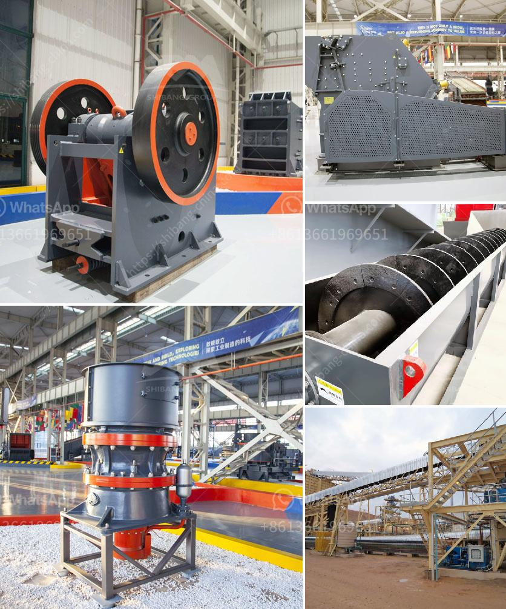

<h3>limestone grinding equipment</h3>
Limestone is a natural sedimentary rock composed primarily of calcium carbonate (CaCO3) in the form of calcite or aragonite. It is commonly used as a building material and has been an essential component in the construction industry for centuries. However, limestone in its raw form cannot be used directly but must first be processed into a fine powder through a limestone grinding equipment.

Limestone grinding equipment is commonly used in various industries, such as power plants, metallurgy, chemical industries, non-metallic minerals processing, building materials, and other fields. It is an essential equipment for processing limestone powder.

One of the most commonly used limestone grinding equipment is Raymond mill. Raymond mill is one of the traditional milling equipment. It is suitable for processing minerals such as limestone, calcite, dolomite, kaolin, talc, bentonite, gypsum, and other materials. Its fineness can be adjusted between 80-800 mesh.

Raymond mill has the advantages of high efficiency, low power consumption, small footprint, and low capital investment. It adopts a vertical structure and covers a relatively small area, which saves the construction cost of the plant. It also has a strong system, which effectively prevents the material from escaping during the grinding process. In addition, the wear-resistant parts of the Raymond mill are made of high-quality materials, which can effectively extend the service life of the equipment.

Another common limestone grinding equipment is the ball mill. The ball mill is a key equipment for grinding the crushed limestone into powder. It is mainly used for the grinding of materials in cement, silicate products, new building materials, refractory materials, fertilizers, black and non-ferrous metal dressing, and glass ceramics industries. The ball mill can grind various ores and other materials dry or wet, allowing for the continuous production of fine powder.

The ball mill has the advantages of simple structure, high efficiency, and energy-saving. It has stable performance and reliable operation. In the process of grinding, it can effectively control the fineness of the limestone powder. The ball mill is also equipped with a dust removal device, which can effectively reduce the dust pollution during the operation.

In addition to Raymond mill and ball mill, there are other limestone grinding equipment available on the market, such as coarse powder mill, high-pressure mill, micro powder grinding mill, and vertical mill, among others. These grinding equipment have their own advantages and characteristics, and users can choose according to their actual production needs.

In conclusion, limestone grinding equipment is essential for the processing of limestone powder. It can not only improve the utilization rate of limestone resources but also bring considerable economic benefits. Whether it is Raymond mill or ball mill, both have their own advantages and can effectively grind limestone into fine powder. However, users should choose the appropriate grinding equipment according to their specific needs to achieve better grinding results.
<h3>Contact us</h3><ul><li><strong>Whatsapp:&nbsp;<a href="https://wa.me/8613661969651">+8613661969651</a></strong></li><li><a href="https://swt.shibang-china.com/?git&amp;zhl&amp;limestone grinding equipment"><strong>Online Service(chat now)</strong></a></li></ul><h3>Related</h3><ul><li><a href='hp cone crusher device.md'>hp cone crusher device</a></li><li><a href='grinding machine in greece.md'>grinding machine in greece</a></li><li><a href='mining screens and crushing equipment.md'>mining screens and crushing equipment</a></li><li><a href='suppliers conveyor belts celaya.md'>suppliers conveyor belts celaya</a></li><li><a href='fly ash grinding machine manufacturer.md'>fly ash grinding machine manufacturer</a></li></ul>