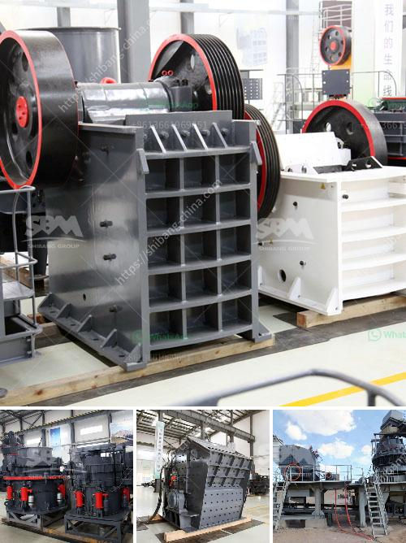

<h3>limestone grinding machine manufactur</h3>
Limestone is a sedimentary rock composed mainly of calcium carbonate (CaCO3), usually in the form of calcite or aragonite. It is also a popular building material, especially for flooring, countertops, and facades.

In order to obtain high-quality limestone powder, limestone grinding machine is essential equipment. Limestone grinding machine include Raymond mill, MTM medium speed trapezium mill, MTW trapezium mill, XZM ultrafine mill. They are all the most popular and high efficient grinding machine in the world. At the beginning of the production line, the most important thing is that we need to carry out installation and commissioning of the machine. limestone grinding mill manufacturer - Shanghai Clirik Machinery Co.,Ltd. Is a large professional manufacturer of limestone grinding mill , specializing in the production of limestone grinding mill, which has rich experience and strong strength.

Before the installation of the limestone grinding mill, workers should get technical training and fully understand the operating principle, and regulations. In order to guarantee the grinding mill in a normal working state, a safety operation system must be established. It is necessary to have the required repairing tools, lubricant and grease, spare parts and accessories on time. At regular intervals, the limestone grinding mill should receive an examination and repairing. The components vulnerable to worn out, such as grinding roller, grinding ring, relieving tool etc. should be repaired or replaced. Before and after the operation, a careful examination should be carried out for the connecting screws, bolts and nuts on the grinding rollers so as to find whether they are loose or sufficiently lubricated.

In the desulfurization process, limestone flour milling equipment is mainly what machine? Producing precipitated calcium carbonate (CC) milling machine can not only vertical mill, but also to mill roller mill. Theses devices can be used for grinding limestone powder for power plant desulfurization CCS milling machine finished fineness is less than 50 microns, and is very suitable for the production of 2000 tons per hour. The type of power plant desulfurization powder required is important factor in determining which limestone grinding mill to choose according to the customers’ requirement. The fineness of limestone grinder can be adjusted freely in the range of 325-3000 meshes, which can also process various materials, such as quartz stone, limestone, slag, etc.

Shanghai Clirik Machinery Co.,Ltd. is a specialized limestone grinding mill manufacturer, devoted to the limestone powder process more than 10 years.Clirik can supply Vertical Roller mill,Raymond Mill,Ball Mill,Ultrafine mill,Hammer mill used for limestone grinding. And our company have gotten the ISO9001:2008, and the HGM limestone grinding mill passed the CE certification. If you are interested in limestone grinding mill, please do not hesitate to contact us! We are looking forward to your cooperation.
<h3>Contact us</h3><ul><li><strong>Whatsapp:&nbsp;<a href="https://wa.me/8613661969651">+8613661969651</a></strong></li><li><a href="https://swt.shibang-china.com/?git&amp;zhl&amp;limestone grinding machine manufactur"><strong>Online Service(chat now)</strong></a></li></ul><h3>Related</h3><ul><li><a href='cobalt ore processing plant setup cost.md'>cobalt ore processing plant setup cost</a></li><li><a href='nigeria cone crusher photos.md'>nigeria cone crusher photos</a></li><li><a href='mobile rock crusher for sale.md'>mobile rock crusher for sale</a></li><li><a href='stone crushers made in china.md'>stone crushers made in china</a></li><li><a href='impact crusher machine manufacturer.md'>impact crusher machine manufacturer</a></li></ul>