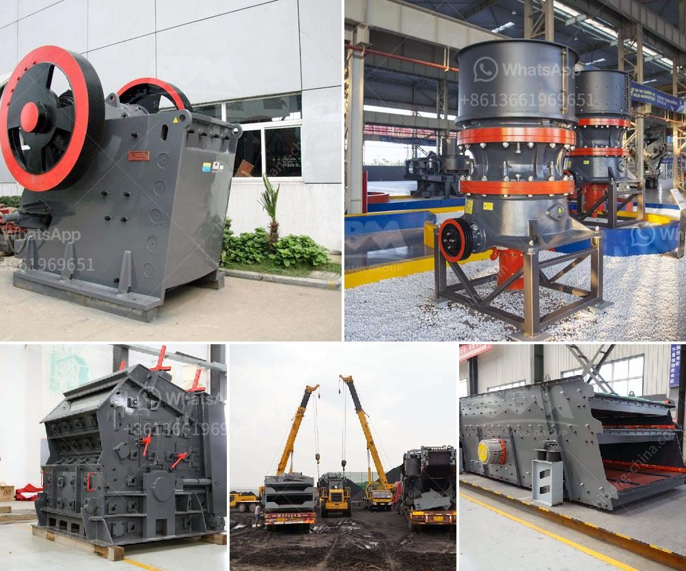

<h3>limestone grinding machine manufacturers in india</h3>
Limestone is a sedimentary rock, composed mainly of calcium carbonate (CaCO3), that naturally forms over millions of years. It’s widely used in various industries, including construction, agriculture, and even manufacturing. Limestone is known for its versatility and durability, making it a popular choice for many applications.

One crucial step in processing limestone is grinding it into a fine powder. This is achieved using a limestone grinding machine. Manufacturers in India offer a wide range of these machines to cater to the growing demand from the construction industry.

Based in Alwar, Rajasthan, Sri Vinayaka Microns has been a key player in the Indian limestone industry for more than a decade. They specialize in producing micronized limestone, which is widely used as filler in various industries such as paints, rubber, plastics, and ceramics. The company offers grinding machines ranging from 5 horsepower to 20 horsepower, suitable for grinding limestone particles into different sizes.

Located in Jodhpur, Rajasthan, Daulat Industries Ltd. is another prominent manufacturer of limestone grinding machines. Their grinding machines are known for their excellent quality and versatility, allowing them to grind limestone into different sizes for various applications. They offer grinding machines with different capacity levels, ranging from 1.5 tons per hour to 50 tons per hour.

With its headquarters in Henan, China, Daswell Machinery is a leading manufacturer of limestone grinding machines. They operate in several countries, including India, and offer a wide range of grinding machines suitable for limestone grinding applications. Their machines are known for their high efficiency and durability. Daswell’s machines come with advanced features like automatic control systems, which ensure optimal grinding performance.

Gupta Grinding Mills is a well-established name in the Indian grinding industry. They specialize in grinding limestone and offer a wide range of grinding machines suitable for various limestone grinding applications. The company ensures the availability of the latest technology and machinery. Gupta Grinding Mills takes pride in its dedicated team of professionals who work tirelessly to deliver the best quality limestone products to their customers.

Kishor Minerals has emerged as a reliable manufacturer of limestone grinding machines in India. They offer a wide range of grinding machines suitable for different limestone grinding applications. Kishor Minerals is known for its commitment to providing environmentally friendly machinery that minimizes energy consumption and reduces carbon footprint.

In conclusion, the limestone grinding machine manufacturers in India cater to the growing demand in the construction industry. These manufacturers offer a wide range of grinding machines, suitable for grinding limestone into different sizes for various applications. With their commitment to quality and innovation, they ensure that the grinding machines deliver optimal performance and efficiency.
<h3>Contact us</h3><ul><li><strong>Whatsapp:&nbsp;<a href="https://wa.me/8613661969651">+8613661969651</a></strong></li><li><a href="https://swt.shibang-china.com/?git&amp;zhl&amp;limestone grinding machine manufacturers in india"><strong>Online Service(chat now)</strong></a></li></ul><h3>Related</h3><ul><li><a href='stone crusher contact.md'>stone crusher contact</a></li><li><a href='ball mill grinding mill.md'>ball mill grinding mill</a></li><li><a href='iron ore vibrator screen.md'>iron ore vibrator screen</a></li><li><a href='quartz plus wet grinder.md'>quartz plus wet grinder</a></li><li><a href='quarry stone supplier in dubai.md'>quarry stone supplier in dubai</a></li></ul>