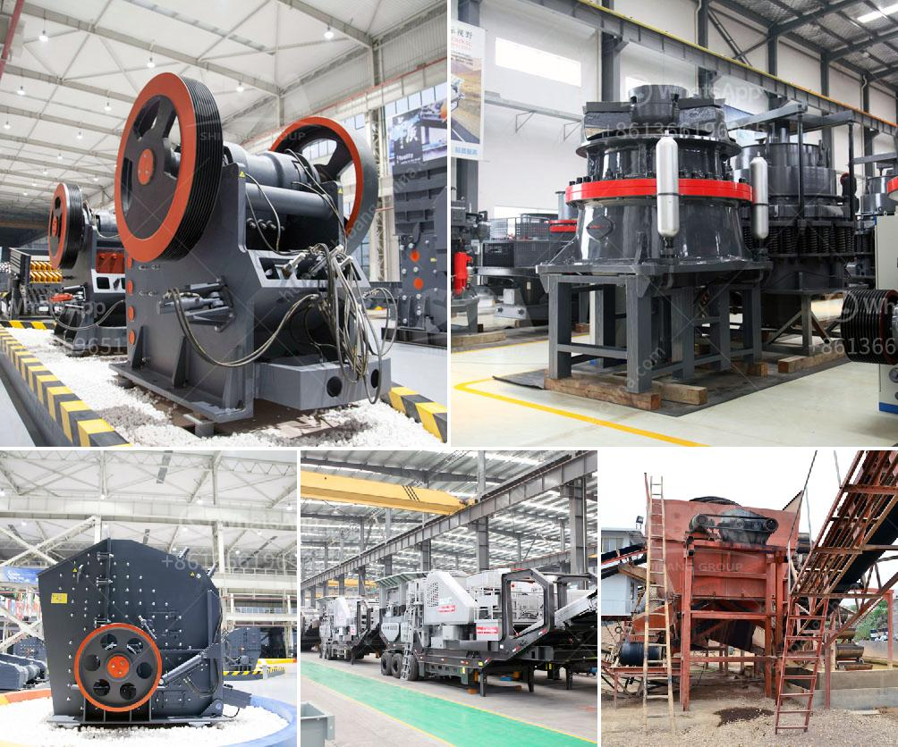

<h3>limestone gypsum crusher machine</h3>
Limestone gypsum crusher machine is the equipment which breaks the limestone gypsum block into smaller particle size. The "feeding" of limestone gypsum crusher machine is usually done by mechanical vibration feeding. The machine work noise is low, and the use of dust removal equipment is optimized. The working speed of the limestone gypsum crusher machine is different depending on the rotation speed of the material during its incoming. The material must be processed according to the maintenance points of the machine. Some of the factors affecting the speed of the limestone gypsum crusher machine are the hardness of the material, the size of the material, and the quality of the equipment.

The crusher machine has a wide range of application materials, such as limestone, slag, coke, coal and other materials. It is widely used in metallurgy, building materials, chemical industry, hydropower, mining, transportation, railway construction, and other fields. The performance and working principle of limestone gypsum crusher machine can effectively treat gypsum materials. According to the characteristics of gypsum, the equipment is improved and innovated on the basis of the traditional mill. Its performance and efficiency are greatly improved.

The limestone gypsum crusher machine uses a hammer hanging device on the roof of the main engine house, and the rotor rotates at high speed in the main engine room. The materials entered from the feed port are collided by the hammer head’s rapidly rotating hammer plate and double grinding groove plate. Crushed by hammer and screen plates, after crushed materials are discharged from the outlet they are automatically sent to a conveyor belt to be collected, separated and classified.

The limestone gypsum crusher machine mainly crushes materials by impact energy, so it has a good crushing effect on materials with low toughness and less brittle materials. The machine cavity has larger volume, so the crushing ability is stronger. In addition, the machine adopts a curved design, which can effectively reduce the energy consumption of the machine, while ensuring the quality of the crushed materials.

The limestone gypsum crusher machine is widely applied in industries like mining, metallurgy, building materials, roads, railways, water conservancy, electricity, etc., to crush all kinds of ores and large materials into particle size within 20-75mm.

1. Vibrating feeder: is used to feed raw materials into the primary limestone gypsum crusher machine evenly and continuously.

2. Jaw crusher: is the widely used primary limestone gypsum crusher machine to crush medium-sized granules of limestone gypsum.

4. Vibrating screen: is used to sift the crushed materials into different sizes according to their size range required by customers.

In conclusion, the limestone gypsum crusher machine is a widely used equipment in the crushing process of limestone, gypsum, and related materials. The machine has the characteristics of simple structure, high crushing ratio, small footprint, low energy consumption, low dust, even particle size of crushed materials, and good particle shape. It is a widely used mechanical equipment for crushing materials.
<h3>Contact us</h3><ul><li><strong>Whatsapp:&nbsp;<a href="https://wa.me/8613661969651">+8613661969651</a></strong></li><li><a href="https://swt.shibang-china.com/?git&amp;zhl&amp;limestone gypsum crusher machine"><strong>Online Service(chat now)</strong></a></li></ul><h3>Related</h3><ul><li><a href='price of grinder machine in pakistan.md'>price of grinder machine in pakistan</a></li><li><a href='gypsum powder line.md'>gypsum powder line</a></li><li><a href='grinding machine capacity 1tph stone crusher machine.md'>grinding machine capacity 1tph stone crusher machine</a></li><li><a href='feldspar grinding plant.md'>feldspar grinding plant</a></li><li><a href='cement processing plant.md'>cement processing plant</a></li></ul>