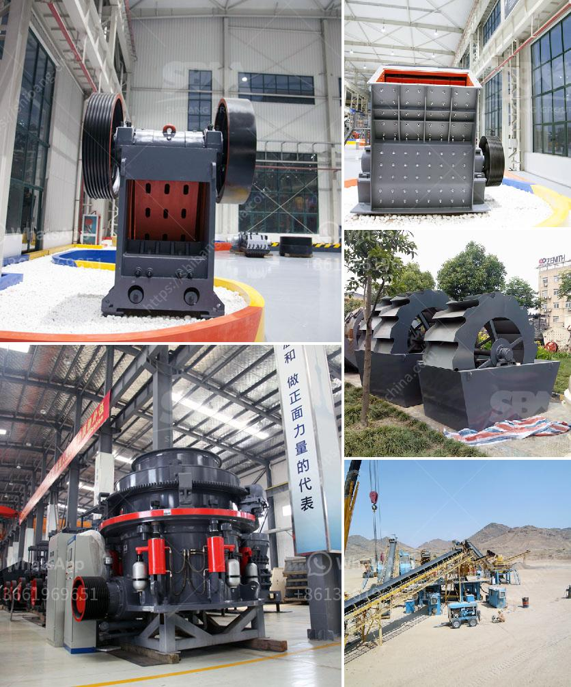

<h3>limestone powder making process</h3>
Limestone is a sedimentary rock composed mainly of calcium carbonate (CaCO3). It is commonly used in the construction industry as a building material. Limestone is a versatile material that is used for various purposes, including making cement, lime, and even in agriculture to improve soil quality.

One of the most common uses of limestone is in the making of cement. Cement is a key ingredient in concrete, which is used to construct bridges, buildings, and other structures. Limestone is first blasted from quarries and then extracted by means of crushers or other mining machines. It is then ground into a powder and mixed with other materials, such as clay, shale, sand, and iron ore, to create a mixture known as raw meal. The raw meal is heated in a kiln at temperatures of approximately 1,450 degrees Celsius to form clinker.

After the clinker is cooled, it is then finely ground with gypsum and other additives to produce cement powder. This process, known as cement milling, involves grinding clinker and gypsum (a material used to regulate the setting time of cement) to a fine powder. The resulting cement powder is then used to produce concrete by mixing it with water, sand, and aggregate.

Another process that utilizes limestone powder is the production of lime. Lime is used in various applications, including as a fluxing agent in steel production, in the construction industry to produce mortar and plaster, and in agriculture to neutralize acidic soils. The process of making lime involves heating limestone to a high temperature in a kiln to produce quicklime or calcium oxide (CaO). This process is called calcination.

First, limestone is crushed into small particles and then it is fed into a kiln. The kiln is typically heated using fossil fuels, such as coal, oil, or natural gas. As the limestone decomposes in the kiln, it releases carbon dioxide gas (CO2), and the calcium carbonate is converted into calcium oxide.

After the quicklime is produced, it is then slaked or mixed with water, which causes it to react and produce heat. This reaction, known as hydration, converts the quicklime into slaked lime or calcium hydroxide (Ca(OH)2). The slaked lime is then used in various applications or further processed to produce lime putty or lime plaster.

In conclusion, the process of limestone powder making involves quarrying the raw material, crushing it, grinding it, and then heating it to produce cement clinker or lime. These processes provide materials that are essential in the construction industry and have various other applications. Limestone powder plays a crucial role in many industries and is a valuable resource with extensive uses.
<h3>Contact us</h3><ul><li><strong>Whatsapp:&nbsp;<a href="https://wa.me/8613661969651">+8613661969651</a></strong></li><li><a href="https://swt.shibang-china.com/?git&amp;zhl&amp;limestone powder making process"><strong>Online Service(chat now)</strong></a></li></ul><h3>Related</h3><ul><li><a href='baxter stone crusher in uk.md'>baxter stone crusher in uk</a></li><li><a href='quote conical vertical impact crusher.md'>quote conical vertical impact crusher</a></li><li><a href='stone crushers machine malaysia.md'>stone crushers machine malaysia</a></li><li><a href='basalt manufacturing plant.md'>basalt manufacturing plant</a></li><li><a href='stone crusher prices.md'>stone crusher prices</a></li></ul>