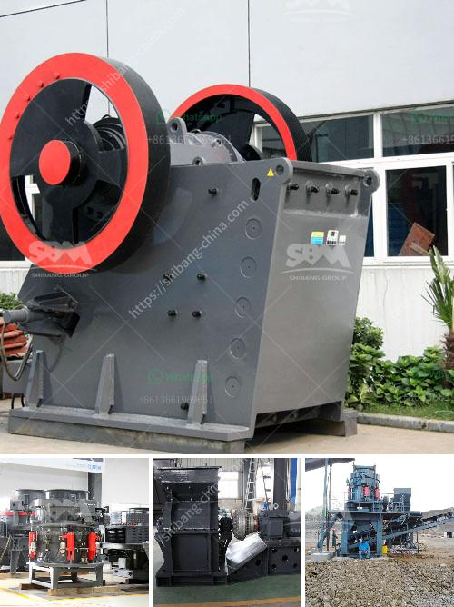

<h3>limestone quarry mining plant price</h3>
Limestone is a sedimentary rock composed mainly of calcium carbonate (CaCO3). It is a widely used material in construction, agriculture, and industry due to its versatile nature. As a result, limestone quarry mining plants play a crucial role in fulfilling the high demand for this valuable resource. However, understanding the factors that influence the price of limestone quarry mining plants is essential for both buyers and stakeholders.

One of the fundamental factors affecting the price of a limestone quarry mining plant is the location. Limestone reserves can be found in various parts of the world, each with its own unique geological conditions. Plants situated in regions where limestone is abundant typically enjoy lower prices due to reduced transportation costs. On the other hand, plants located in areas with limited limestone resources may incur higher costs, as raw materials need to be transported over longer distances, leading to increased logistics expenses.

The scale of the mining plant is another crucial aspect influencing its price. Limestone quarry mining plants can range in size from small-scale operations to large-scale industrial complexes. Larger quarry mining plants generally have a higher initial investment cost due to the need for advanced machinery and equipment. However, they often benefit from economies of scale, allowing them to produce limestone in large quantities, thereby reducing production costs and the overall price per unit.

Technological advancements and automation also play a significant role in determining the price of limestone quarry mining plants. In recent years, the mining industry has witnessed several breakthroughs in technology, such as advanced drilling, blasting, and crushing techniques. These innovations improve efficiency, reduce labor costs, and enhance overall productivity. As a result, modernized limestone quarry mining plants that embrace automation and employ advanced technologies often command higher prices due to their increased production capacity and cost-effectiveness.

Environmental regulations and sustainability practices also impact the pricing of limestone quarry mining plants. In many countries, there are strict regulations in place to ensure responsible mining practices, including the protection of natural habitats and water resources. Compliance with these regulations necessitates additional investments, such as wastewater treatment systems and land rehabilitation. Consequently, limestone quarry mining plants that prioritize sustainable practices and have lower environmental footprints might have higher upfront costs, leading to a correspondingly higher price.

Finally, market demand and competition heavily impact the price of limestone quarry mining plants. In regions where the demand for limestone is high, such as areas experiencing rapid urbanization or significant infrastructure development, the cost of mining plants tends to be higher due to increased competition among suppliers. Alternatively, in regions with declining demand, mining plants might offer more competitive prices to attract customers and maintain profitability.

In conclusion, the price of limestone quarry mining plants is influenced by various factors. These include the location of the plant, its scale, technological advancements, environmental regulations, and market demand. Understanding these factors can help buyers and stakeholders make informed decisions and predict future market trends. As the demand for limestone continues to grow, ensuring a sustainable supply of this valuable resource while maintaining reasonable prices remains vital for the construction, agriculture, and industrial sectors.
<h3>Contact us</h3><ul><li><strong>Whatsapp:&nbsp;<a href="https://wa.me/8613661969651">+8613661969651</a></strong></li><li><a href="https://swt.shibang-china.com/?git&amp;zhl&amp;limestone quarry mining plant price"><strong>Online Service(chat now)</strong></a></li></ul><h3>Related</h3><ul><li><a href='crusher machine seller.md'>crusher machine seller</a></li><li><a href='jaw crushing plant.md'>jaw crushing plant</a></li><li><a href='sand crusher cost.md'>sand crusher cost</a></li><li><a href='alluvial chrome wash plant in zimbabwe.md'>alluvial chrome wash plant in zimbabwe</a></li><li><a href='iron ore vibrator screen.md'>iron ore vibrator screen</a></li></ul>