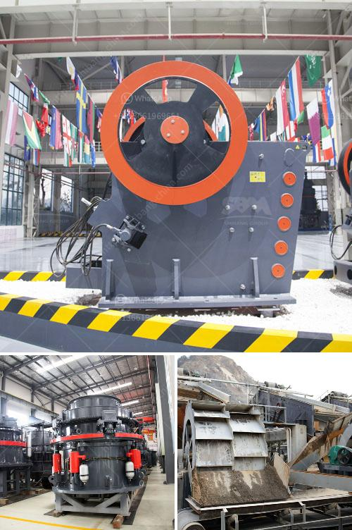

<h3>limestone rock +crusher</h3>
Limestone is a sedimentary rock that is predominantly composed of calcium carbonate, also known as calcite. It can form in a variety of environments, including marine, depositional, and evaporative, and is often found as a result of these processes. Limestone has been used for centuries as a building material and is widely mined across the globe.

One important aspect of limestone is that it is a versatile material that can be used in various industries, including construction, agriculture, and manufacturing. In order to meet the growing demand, limestone is often crushed to incorporate into different products. This is where a limestone rock crusher comes in.

Limestone is a sedimentary rock, so it must be processed by crushing and grinding processes before it can be used. The initial crushing process usually involves a primary crusher, such as a jaw crusher or gyratory crusher, followed by secondary crushers to further reduce the size.

In a typical limestone crushing process, a primary impact crusher or secondary impact crusher can be used. A primary impact crusher is used for crushing limestone to a size as small as minus 40 centimeters or less. The crusher is fed by a vibrating grizzly feeder which takes away unwanted fines and produces a product that is suitable for pre-crushing or secondary crushing.

Once the limestone is crushed, it can be utilized for a variety of purposes. One common use for crushed limestone is as a base material for highways, roads, and parking lots. It provides a stable surface that can withstand heavy traffic and weather conditions. Additionally, it helps to prevent erosion by acting as a barrier between the soil and the surface.

Crushed limestone is also commonly used in the construction industry as an aggregate for concrete. It adds strength and durability to the concrete mixture and can reduce the amount of cement required. This makes it an environmentally friendly option as it reduces the carbon footprint associated with cement production.

Furthermore, limestone can be ground into a fine powder, known as limestone dust or limestone fines. This powder is often used in agriculture as a soil conditioner to improve soil quality and promote healthy plant growth. It contains essential nutrients such as calcium and magnesium that are necessary for plants to thrive.

Limestone rock crushers are widely used in the mining industry. They are used to crush soft and hard rocks into smaller pieces. In mining applications, limestone is extracted from the ground through a mining process where heavy machinery is used to extract and transport the stone. The extracted limestone is then processed by crushing plants to produce various products.

In conclusion, limestone is a versatile rock that can be crushed and used in various industries. The limestone rock crusher is a powerful machine that helps to break down stones and rock materials into smaller pieces, enabling them to be used in many different applications. Whether crushed to be used for highways, roads, concrete aggregates, or agriculture, limestone is undoubtedly an essential and valuable resource.
<h3>Contact us</h3><ul><li><strong>Whatsapp:&nbsp;<a href="https://wa.me/8613661969651">+8613661969651</a></strong></li><li><a href="https://swt.shibang-china.com/?git&amp;zhl&amp;limestone rock crusher"><strong>Online Service(chat now)</strong></a></li></ul><h3>Related</h3><ul><li><a href='stone paper production machine.md'>stone paper production machine</a></li><li><a href='vertical mill mining.md'>vertical mill mining</a></li><li><a href='grinding mill prices in south africa.md'>grinding mill prices in south africa</a></li><li><a href='ball mill mexico.md'>ball mill mexico</a></li><li><a href='serie dgs utiliza en piedra linea de produccion.md'>serie dgs utiliza en piedra linea de produccion</a></li></ul>