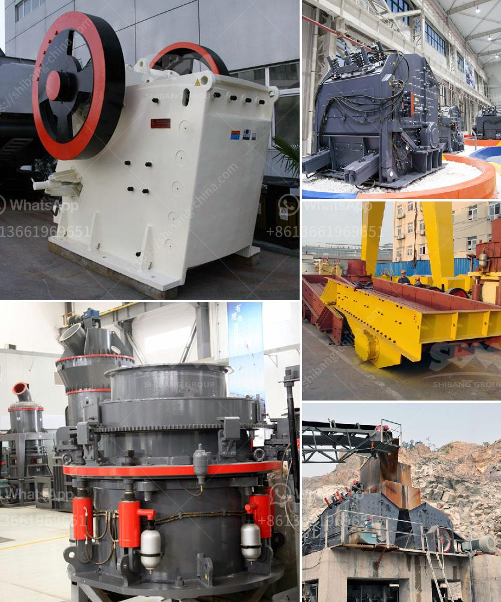

<h3>linear vibrating screen specifications</h3>
Linear vibrating screen is a commonly used screen equipment in the mining industry. It has the characteristics of large output, high screening accuracy, and high screening efficiency. In the operation process, the linear vibrating screen should pay attention to some issues to avoid damage to the equipment. This article will introduce the specifications and precautions of the linear vibrating screen in detail.

Firstly, let's understand the specifications of the linear vibrating screen. The size of the screen surface of the linear vibrating screen directly affects the screening efficiency and processing capacity of the equipment. The larger the sieve surface area, the higher the screening efficiency and processing capacity. The common sizes of linear vibrating screens are 1.5 meters and 3 meters wide, and the length is generally larger than 4 meters.

Secondly, the material of the linear vibrating screen is an important factor affecting its performance. The screen frame and the vibrating screen are made of high-quality steel materials, which have a high tensile strength and are not easy to deform. The screen mesh is made of manganese steel wire or stainless steel wire, which has the characteristics of wear resistance and long service life.

In addition, the vibration motor is an important part of the linear vibrating screen. The horizontal vibrating motor rotates in a certain direction through the coupling, which makes the screen box vibrate in a linear motion. The vibration motor has the characteristics of large excitation force, low energy consumption, and low noise. The amplitude and frequency of the linear vibrating screen can be adjusted by changing the angle of the eccentric block in the vibration motor.

When using the linear vibrating screen, users should also pay attention to some precautions to avoid damage to the equipment. Firstly, the linear vibrating screen should operate within the specified voltage range to ensure stable operation of the motor. Secondly, the user should regularly check the tension of the screen, the fastening condition of the bolts, and the sealing condition of the screen box to prevent leakage.

Furthermore, during the operation of the linear vibrating screen, the user should pay attention to the feeding amount. Overloading feeding will not only affect the screening efficiency but also easily damage the equipment. It is necessary to ensure a reasonable feeding amount according to the processing capacity of the linear vibrating screen.

In conclusion, the linear vibrating screen is a widely used screening equipment in the mining industry. It has the advantages of large output, high screening accuracy, and high screening efficiency. The specifications of the linear vibrating screen include the size of the screen surface, the material of the screen, and the characteristics of the vibration motor. Users should also pay attention to the precautions during the operation of the linear vibrating screen to ensure the normal operation of the equipment and prolong the service life.
<h3>Contact us</h3><ul><li><strong>Whatsapp:&nbsp;<a href="https://wa.me/8613661969651">+8613661969651</a></strong></li><li><a href="https://swt.shibang-china.com/?git&amp;zhl&amp;linear vibrating screen specifications"><strong>Online Service(chat now)</strong></a></li></ul><h3>Related</h3><ul><li><a href='silica sand pulverizer.md'>silica sand pulverizer</a></li><li><a href='mineral grinding mill machine used for sale uk.md'>mineral grinding mill machine used for sale uk</a></li><li><a href='complete crushing plant.md'>complete crushing plant</a></li><li><a href='working of jaw crusher.md'>working of jaw crusher</a></li><li><a href='impact coal crusher.md'>impact coal crusher</a></li></ul>