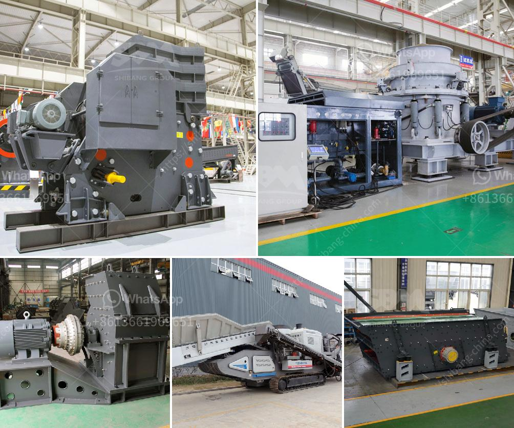

<h3>list of crusher in bharatpur distric</h3>
Bharatpur district, located in the Indian state of Rajasthan, is known for its historic significance and rich cultural heritage. It is home to several tourist attractions, including the famous Keoladeo National Park, a UNESCO World Heritage Site. In addition to its natural and man-made wonders, Bharatpur district also houses several industries, including the stone crushing industry.

Stone crushing is a major industry in Bharatpur district. As per the guidelines provided by the Ministry of Environment and Forests (MoEF), stone crushing units should follow strict norms to ensure the protection of the environment and minimize occupational hazards. However, the reality is often different, with many stone crushers flouting these norms.

There are several stone crushers operating in Bharatpur district, each catering to the growing demand for construction materials. The crushers are mainly located in the outskirts of the city, near the major construction sites. The stone crushing industry plays a vital role in the growth of the economy by providing the much-needed raw materials for various construction activities.

One of the prominent stone crushers in Bharatpur district is the famous Krishna Stone Crusher. It is located in Kaman, near the National Highway 8, which passes through Bharatpur district. This particular stone crusher has been infamous for causing severe air pollution due to the emission of fine dust particles. Despite the warnings and fines imposed by the authorities, the owners have failed to take appropriate measures to mitigate air pollution.

Another crusher that has been a cause of concern in Bharatpur district is the Goyal Stone Crusher. Situated in Bayana, it has been operating without obtaining the necessary permissions from the concerned authorities. The residents in the surrounding areas have filed multiple complaints regarding the noise and air pollution caused by this crusher.

Apart from these two prominent crushers, there are several other stone crushing units scattered across Bharatpur district. These include the Shree Balaji Stone Crusher in Pahadi, the Kedar Stone Crusher and Building Material Suppliers in Bijalpur, and the Shri Shyam Stone Crusher in Kaman. While some of these crushers have complied with the guidelines provided by the MoEF, there are many others that have not.

The stone crushing industry in Bharatpur district has also been under scrutiny due to the illegal extraction of minerals from the Aravalli hills. Many crushers operate in close proximity to these hills, resulting in rampant illegal mining. The stone crushers not only cause environmental degradation but also threaten the fragile ecosystem of the Aravalli hills.

The government and concerned authorities have been taking steps to regulate the stone crushing industry in Bharatpur district. Awareness campaigns, fines, and even the closure of some crushers have been initiated in an attempt to curb the pollution and illegal practices. However, more needs to be done to ensure strict adherence to environmental norms and protect the local communities.

In conclusion, Bharatpur district is home to several crushers that are contributing to the growth of the construction industry. However, the lack of adherence to environmental norms and rampant illegal mining have raised concerns about the impact on the environment and the health of the local communities. The government and concerned authorities must take swift and strict action to address these issues and ensure the sustainable development of the stone crushing industry in Bharatpur district.
<h3>Contact us</h3><ul><li><strong>Whatsapp:&nbsp;<a href="https://wa.me/8613661969651">+8613661969651</a></strong></li><li><a href="https://swt.shibang-china.com/?git&amp;zhl&amp;list of crusher in bharatpur distric"><strong>Online Service(chat now)</strong></a></li></ul><h3>Related</h3><ul><li><a href='concrete mobile crusher for rent in usa.md'>concrete mobile crusher for rent in usa</a></li><li><a href='turkey stone crushers.md'>turkey stone crushers</a></li><li><a href='linear vibrating screen specifications.md'>linear vibrating screen specifications</a></li><li><a href='stone crusher ethiopia.md'>stone crusher ethiopia</a></li><li><a href='quarry equipment for sale.md'>quarry equipment for sale</a></li></ul>