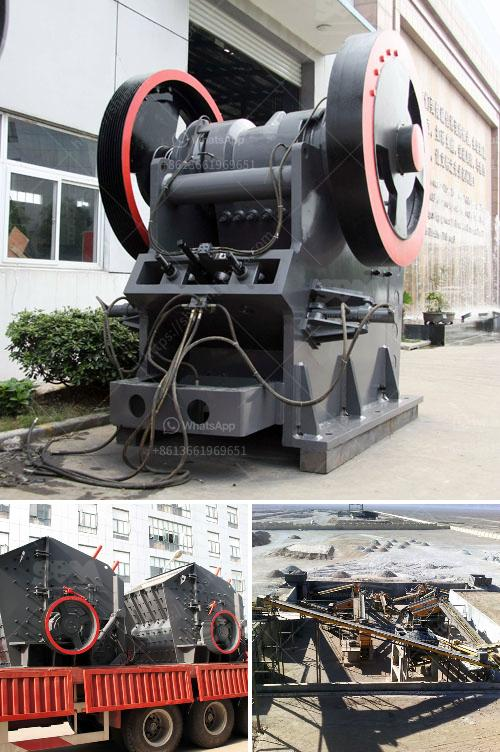

<h3>list of equipments use in cement factory</h3>
A cement factory is a crucial and dynamic establishment that produces cement used in various construction projects. To meet the increasing demand for cement, these factories require a range of equipment and machinery. In this article, we will discuss the list of equipment used in a cement factory.

1. Crushers: As the name suggests, crushers are used to crush the raw materials into smaller and more manageable pieces. They are typically heavy-duty machines that consist of a rotating drum with steel balls or rods inside. Crushers effectively break down the raw materials, such as limestone, shale, and clay, to a size suitable for further processing.

2. Raw Mill: After the raw materials are crushed, they are conveyed to the raw mill, where they are mixed and refined. The raw mill is a cylindrical vessel with a rotating ball or roller inside it. The mixture of crushed materials and water is fed into the mill, which grinds and homogenizes the mixture into a fine powder.

3. Kiln: The kiln is the heart of the cement manufacturing process. It is a large rotating furnace where the raw materials mix is heated to temperatures up to 1450 degrees Celsius (2642 degrees Fahrenheit). This high temperature causes chemical reactions that transform the raw materials into clinker, which is a semi-finished product resembling small, dark nodules.

4. Cooler: After leaving the kiln, the clinker must be rapidly cooled to preserve its quality. The cooler is responsible for this cooling process. It is a large, rotating cylinder with cooling fans that blow ambient air onto the clinker, reducing its temperature to around 100 degrees Celsius (212 degrees Fahrenheit).

5. Cement Mill: The cooled clinker is then ground into a fine powder in the cement mill. This process involves the use of grinding media such as steel balls or rods to crush and grind the clinker into the desired fineness. The powdered cement is then stored in silos for further use.

6. Cement Silos: These are large storage containers used to store the powdered cement before it is dispatched to customers. The silos are typically made of steel and can hold thousands of tons of cement. They are fitted with a system for controlled extraction and loading of the cement into trucks or railway wagons.

7. Packing Machine: Once the cement is ready for dispatch, it needs to be packed into bags or other containers. Packing machines are used to automatically fill and seal the bags with the correct amount of cement. These machines ensure accuracy and efficiency in the packaging process.

8. Dust Collectors: Cement factories generate a significant amount of dust during the manufacturing process. Dust collectors are installed throughout the factory to capture and remove airborne dust particles, ensuring a cleaner and safer working environment.

9. Conveyor Belts: Conveyor belts are used to transport raw materials, clinker, and other materials throughout the factory. These belts facilitate the smooth and efficient movement of materials between different stages of the manufacturing process.

10. Compressors: Compressors are essential in cement factories for providing compressed air required for various operations, such as operating pneumatic machinery, instrument control, and aeration.

In conclusion, a cement factory requires a diverse range of equipment to produce high-quality cement efficiently. Crushers, raw mills, kilns, coolers, cement mills, cement silos, packing machines, dust collectors, conveyor belts, and compressors are some of the key equipment used in a cement factory. Each piece of equipment plays a crucial role in the overall manufacturing process, ensuring the production of cement that meets industry standards.
<h3>Contact us</h3><ul><li><strong>Whatsapp:&nbsp;<a href="https://wa.me/8613661969651">+8613661969651</a></strong></li><li><a href="https://swt.shibang-china.com/?git&amp;zhl&amp;list of equipments use in cement factory"><strong>Online Service(chat now)</strong></a></li></ul><h3>Related</h3><ul><li><a href='stone crushers for sale uk finance.md'>stone crushers for sale uk finance</a></li><li><a href='second hand stone production line for.md'>second hand stone production line for</a></li><li><a href='quote conical vertical impact crusher.md'>quote conical vertical impact crusher</a></li><li><a href='metal crusher machine for rent in sri lanka.md'>metal crusher machine for rent in sri lanka</a></li><li><a href='ultra fine grinding mills.md'>ultra fine grinding mills</a></li></ul>