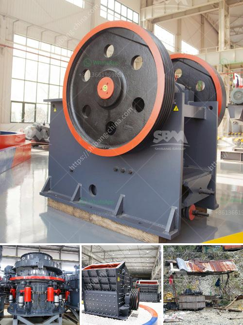

<h3>list of machinery in gypsum crushing and limestone</h3>
Gypsum and limestone are important minerals that are widely used in various industries. For instance, gypsum is commonly used as a plastering material in the construction industry, while limestone is used as a raw material in manufacturing cement and concrete. With such diverse uses, it is crucial to have efficient machinery in place for crushing these minerals. In this article, we will explore the list of machinery commonly used in gypsum crushing and limestone industries.

A jaw crusher is a powerful machine that breaks down the material into smaller sizes. This equipment consists of two jaws, one fixed and one moving, with the material being squeezed and crushed between the jaws. The jaw crusher is used to crush various types of minerals, such as gypsum, limestone, and concrete aggregate.

An impact crusher utilizes the impact force to crush the materials effectively. The material is fed into a chamber that contains a rotating rotor, which strikes the material, causing it to break into smaller pieces. Impact crushers are commonly used in the production of Gypsum boards and limestone for road construction.

A cone crusher is similar to a gyratory crusher but operates with a different chamber design. The material is fed into the chamber through a hopper and is crushed between an eccentrically rotating cone and a concave hopper. Cone crushers are often used in the secondary and tertiary crushing stages for gypsum and limestone processing.

A hammer crusher is characterized by its high production capacity and thereduction ratio. It uses a series of hammers to crush the material, which are mounted on a rotating shaft. Hammer crushers are primarily used in the mining and construction industries for crushing gypsum and limestone.

A vibrating feeder is an essential machine that feeds materials uniformly into the crushing equipment. It ensures a steady flow of material, preventing blockages and maintaining an efficient operation. Vibrating feeders are commonly used in gypsum and limestone crushing plants to control and regulate the feeding process.

A vibrating screen is used to separate and grade the crushed materials into different sizes. It consists of a screen mesh that vibrates, allowing particles of specific sizes to pass through while larger particles are retained for further crushing. Vibrating screens are crucial in gypsum crushing and limestone production to ensure the desired size of the final product.

Conveyor belts are used to transport the crushed materials from one stage of the crushing process to another. They are designed to handle heavy loads and facilitate efficient material handling. In gypsum and limestone industries, conveyor belts are extensively used to transport the crushed material to storage or processing areas efficiently.

In conclusion, the gypsum crushing and limestone industries rely on various machinery to process and crush these minerals effectively. Jaw crushers, impact crushers, cone crushers, hammer crushers, vibrating feeders, screens, and conveyor belts are some of the commonly used machinery in these industries. Choosing the right machinery for each application is crucial for efficient and high-quality production in the gypsum and limestone industries.
<h3>Contact us</h3><ul><li><strong>Whatsapp:&nbsp;<a href="https://wa.me/8613661969651">+8613661969651</a></strong></li><li><a href="https://swt.shibang-china.com/?git&amp;zhl&amp;list of machinery in gypsum crushing and limestone"><strong>Online Service(chat now)</strong></a></li></ul><h3>Related</h3><ul><li><a href='hammer mill price south africa.md'>hammer mill price south africa</a></li><li><a href='stone manufacturing process.md'>stone manufacturing process</a></li><li><a href='gypsum milling prices in kenya.md'>gypsum milling prices in kenya</a></li><li><a href='small ball grinding machine.md'>small ball grinding machine</a></li><li><a href='price of conveyor belts.md'>price of conveyor belts</a></li></ul>