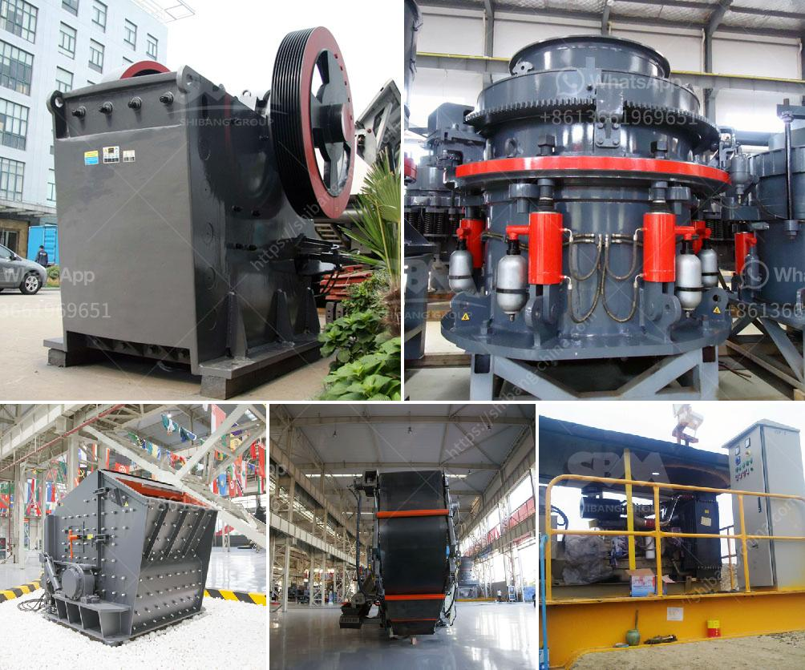

<h3>list of machinery used for open pit mining</h3>
Open pit mining is a type of mining operation that involves the extraction of minerals or other geological materials from the Earth through an open pit or borrow. This type of mining is typically used when the minerals or rocks being sought are near the surface, as it is more cost-effective to extract them from open pits rather than underground mines. The machinery used for open pit mining primarily depends on the type of deposit being mined and the equipment available at the time the mine is established.

Copper mining is one of the most common types of open pit mining. Copper is commonly extracted from deposits such as porphyry, which occur in large, low-grade ore bodies. This type of deposit is typically mined using large-scale excavation equipment such as bucket-wheel excavators, draglines, and shovels.

Bucket-wheel excavators are among the largest machines used in open pit mining. They are used to remove large quantities of overburden (earth and rock covering the deposit) to access the ore body. These machines are used in conjunction with haul trucks to transport the extracted material to the processing plant.

Draglines are another type of excavation equipment commonly used in open pit mining. They are large, heavy machines that consist of a bucket suspended from a boom. The bucket is lowered into the pit and, using a dragline mechanism, it scoops up the material and deposits it onto a conveyor system or into haul trucks. Draglines are highly efficient and can handle large quantities of material with ease.

Shovels are also commonly used in open pit mining. These machines have a bucket attached to a long boom, which is used to excavate material from the pit. Shovels can be diesel-powered or electrically powered, depending on the specific requirements of the mine. They are generally used for smaller-scale excavation projects or for removing overburden in smaller quantities.

In addition to excavation equipment, a range of other machinery is also used in open pit mining operations. These include drilling rigs, blasting equipment, haul trucks, and loaders. Drilling rigs are used to create boreholes or wells in the ground, which are then filled with explosives to break up the rock and make it easier to extract. Haul trucks are used to transport the extracted material from the pit to the processing plant, while loaders are used to load the material onto the trucks.

Overall, open pit mining requires a wide range of equipment and machinery in order to extract minerals or rocks from the Earth efficiently. However, there are some challenges associated with this type of mining. For example, the large-scale excavation and extraction can have significant environmental impacts, such as the destruction of habitats and the contamination of water sources. Therefore, it is important for mining companies to implement effective environmental management practices to mitigate these impacts and ensure the sustainability of open pit mining operations.

In conclusion, open pit mining involves the use of various machinery and equipment to extract minerals or rocks from the Earth. These machines are used to excavate, transport, and process the extracted material. While open pit mining is a cost-effective and efficient way to extract minerals, it is essential for mining companies to prioritize environmental sustainability and implement responsible mining practices.
<h3>Contact us</h3><ul><li><strong>Whatsapp:&nbsp;<a href="https://wa.me/8613661969651">+8613661969651</a></strong></li><li><a href="https://swt.shibang-china.com/?git&amp;zhl&amp;list of machinery used for open pit mining"><strong>Online Service(chat now)</strong></a></li></ul><h3>Related</h3><ul><li><a href='pe series jaw crusher and ton per day.md'>pe series jaw crusher and ton per day</a></li><li><a href='medium jaw crusher gold mill for sale.md'>medium jaw crusher gold mill for sale</a></li><li><a href='hammer for crushing concrete.md'>hammer for crushing concrete</a></li><li><a href='vertical vertical inspection method.md'>vertical vertical inspection method</a></li><li><a href='quartz stone crushers materials.md'>quartz stone crushers materials</a></li></ul>