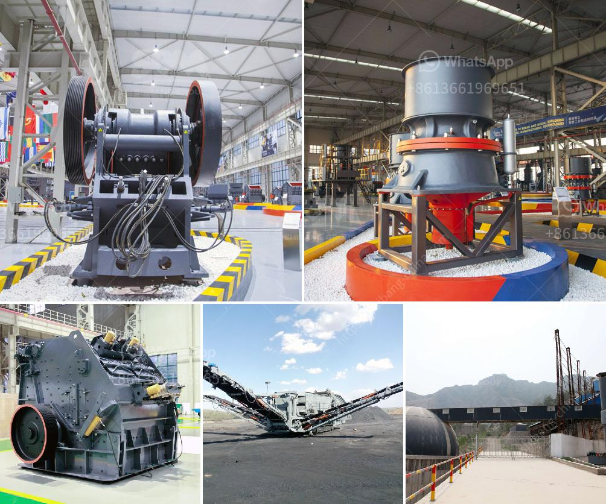

<h3>lm series vertical mill</h3>
The LM series vertical mill is a versatile and efficient grinding equipment that combines advanced grinding technology, classifying technology, and drying technology in one unit. It is widely used in industries such as cement, electric power, metallurgy, chemical, non-metallic mineral, and others.

The LM series vertical mill is designed to grind materials with maximum granularity of 10mm into fine powder with a particle size range of 0.038mm to 0.18mm. The main components of this mill are the grinding roller and the grinding ring, which are made of wear-resistant materials.

One of the key features of the LM series vertical mill is its high efficiency. The mill has a large feed size and a high grinding energy utilization rate, which greatly improves the production capacity. In addition, the mill has a low energy consumption, which helps reduce operating costs.

Another advantage of the LM series vertical mill is its stable operation. The mill is equipped with a hydraulic device that enables the grinding roller to be pressed on the grinding ring with a uniform force. This ensures a stable and consistent grinding process, reducing vibration and noise levels.

Furthermore, the LM series vertical mill has a high degree of automation. The mill is equipped with a centralized control system that can monitor and control the entire grinding process. This allows operators to easily adjust the parameters and maintain the optimal grinding conditions for maximum productivity.

In terms of environmental protection, the LM series vertical mill is equipped with a dust collection system. This system effectively collects and removes dust and other pollutants generated during the grinding process. This not only improves the working environment but also reduces the emission of harmful substances into the atmosphere.

Moreover, the LM series vertical mill is easy to maintain. The mill has a simple structure with few wearing parts, making it easy to replace and maintain. Routine maintenance can be done easily, helping to minimize downtime and ensure continuous production.

In conclusion, the LM series vertical mill is a reliable and efficient grinding equipment that offers numerous advantages. It has a high grinding efficiency, stable operation, high degree of automation, and is environmentally friendly. Its versatility and adaptability in various industries make it an ideal choice for grinding and processing various materials.
<h3>Contact us</h3><ul><li><strong>Whatsapp:&nbsp;<a href="https://wa.me/8613661969651">+8613661969651</a></strong></li><li><a href="https://swt.shibang-china.com/?git&amp;zhl&amp;lm series vertical mill"><strong>Online Service(chat now)</strong></a></li></ul><h3>Related</h3><ul><li><a href='quarry equipment for sale in indonesia.md'>quarry equipment for sale in indonesia</a></li><li><a href='machinery required for stone crusher.md'>machinery required for stone crusher</a></li><li><a href='hammer mill technical specification.md'>hammer mill technical specification</a></li><li><a href='rock crushers tonne per hour.md'>rock crushers tonne per hour</a></li><li><a href='cement plant layout consultants in south africa.md'>cement plant layout consultants in south africa</a></li></ul>